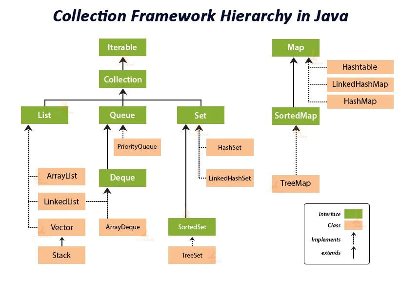

## CollectionsPro

[1. Что такое generics?](#1-что-такое-generics)

[2. Что такое wild cards?](#2-что-такое-wild-cards)

[3. Что такое bounded wild cards?](#3-что-такое-bounded-wild-cards)

[4. Что такое unbounded wild cards?](#4-Что-такое-unbounded-wild-cards)

[5. Где хранится информация про Generics?](#5-Где-хранится-информация-про-Generics)

[6. Как можно получить тип Generics?](#6-Как-можно-получить-тип-Generics)

[7. Что такое итератор? В чем разница между iterator и listIterator? Что такое fail-fast и fail-safe поведение итератора и в чем между ними разница? Когда возникает ConcurrentModificationException?](#7-Что-такое-итератор-В-чем-разница-между-iterator-и-listIterator-Что-такое-fail-fast-и-fail-safe-поведение-итератора-и-в-чем-между-ними-разница-Когда-возникает-ConcurrentModificationException)

[8. Что такое коллекции?](#8-Что-такое-коллекции)

[9. Назовите базовые интерфейсы коллекций?](#9-Назовите-базовые-интерфейсы-коллекций)

[10. Расскажите реализации интерфейса List?](#10-Расскажите-реализации-интерфейса-List)

[11. Расскажите реализации интерфейса Set?](#11-Расскажите-реализации-интерфейса-Set)

[12. Расскажите реализации интерфейса Map?](#12-Расскажите-реализации-интерфейса-Map)

[13. Отличие ArrayList от LinkedList?](#13-Отличие-ArrayList-от-LinkedList)

[14. Отличие Set от List?](#14-Отличие-Set-от-List)

[15. Расскажите про методы Object hashCode и equals?](#15-Расскажите-про-методы-Object-hashCode-и-equals)

[16. Расскажите, что такое коллизии в Map? Как с ними бороться?](#16-Расскажите-что-такое-коллизии-в-Map-Как-с-ними-бороться)

[17. Расскажите, что такое анализ алгоритма?](#17-Расскажите-что-такое-анализ-алгоритма)

[18. Какая временная сложность алгоритмов добавления, замены и удаления в каждой из коллекций? С чем связаны отличия?](#18-Какая-временная-сложность-алгоритмов-добавления-замены-и-удаления-в-каждой-из-коллекций-С-чем-связаны-отличия)

[19. Расскажите реализации данных очередей и стеков.](#19-Расскажите-реализации-данных-очередей-и-стеков)

[20. Расскажите про реализации деревьев.](#20-Расскажите-про-реализации-деревьев)

[21. Что такое loadFactor?](#21-Что-такое-loadFactor)

[22. Перечислите побитовые логические операции, которые Вы знаете? Расскажите, как они работают.](#22-Перечислите-побитовые-логические-операции-которые-Вы-знаете-Расскажите-как-они-работают)

[23. Расскажите про операции сдвига. Какие они бывают и что делают?](#23-Расскажите-про-операции-сдвига-Какие-они-бывают-и-что-делают)

[24. Как хранится знак числа в Java? Как хранятся отрицательные числа?](#24-Как-хранится-знак-числа-в-Java-Как-хранятся-отрицательные-числа)

[25. Расскажите о системах сборки проекта. В чем отличие систем сборки Ant, Maven и Gradle?](#25-Расскажите-о-системах-сборки-проекта-В-чем-отличие-систем-сборки-Ant-Maven-и-Gradle)

[26. Как создать maven проект?](#26-Как-создать-maven-проект)

[27. Какова структура maven проекта?](#27-Какова-структура-maven-проекта)

[28. Расскажите о файле pom xml. Как он структурирован и за что отвечает содержание каждой части?](#28-Расскажите-о-файле-pom-xml-Как-он-структурирован-и-за-что-отвечает-содержание-каждой-части)

[29. Что такое координаты зависимости?](#29-Что-такое-координаты-зависимости)

[30. Что такое транзитивные зависимости?](#30-Что-такое-транзитивные-зависимости)

[31. Что такое область видимости зависимости? Сколько областей видимости предусмотрено и где они применяются?](#31-Что-такое-область-видимости-зависимости-Сколько-областей-видимости-предусмотрено-и-где-они-применяются)

[32. Расскажите о жизненном цикле maven. В какой последовательности выполняются фазы цикла и что происходит на каждой фазе сборки?](#32-Расскажите-о-жизненном-цикле-maven-В-какой-последовательности-выполняются-фазы-цикла-и-что-происходит-на-каждой-фазе-сборки)

# 1. Что такое generics?

Дженерики это запись, заключенная в скобки `<>`, Они позволяют указать тип элементов,
которые могут храниться в коллекции(типовые параметры(T, E, V, K и тд), классы и интерфейсы, обертки для примитивных
типов), в такую коллекцию можно добавить только
объекты, являющиеся экземплярами класса указанного в угловых скобках. Например, если в угловых скобках указан тип
String, то в коллекцию можно добавить только элементы являющиеся экземпляром класса String, при попытке добавить
экземпляр другого класса - мы получим ошибку компиляции

Дженерики в Java были добавлены в версии 1.5 и активно используются в коллекциях. До появления дженериков все коллекции
работали с типом Object, и при извлечении элементов приходилось выполнять приведение
типов (down-cast) от Object к нужному типу. Если приведение было невозможно, возникала ошибка ClassCastException.
Дженерики устраняют эту проблему, обеспечивая безопастность добавляемых типов на этапе компиляции.

[К оглавлению](#CollectionsPro)

# 2. Что такое wild cards?

Wildcards в Java используются в обобщениях для обозначения неизвестного типа. Это удобно, когда вы хотите работать с
различными типами данных, но не хотите жёстко задавать конкретный тип. Wildcards представляются символом вопросительного
знака (?). Используется, когда тип данных может быть абсолютно любым. Не используйте wildcard, если нужно производить
и запись, и чтение, потому что компилятор не может определить, какой тип данных безопасен для добавления.

````java
List<?> list = new ArrayList<>();
`````

[К оглавлению](#CollectionsPro)

# 3. Что такое bounded wild cards?

Ограниченный wildcard с верхней границей (<? extends Type>). Используется, когда тип данных должен быть подтипом (или
самим типом) указанного класса. Если необходимо читать из контейнера, то
используйте wildcard с верхней границей "? extends". Например:

````java
List<? extends Number> list = new ArrayList<>();
````

Здесь list может содержать элементы типа Number, Integer, Double, и других классов, которые являются подтипами Number.

[К оглавлению](#CollectionsPro)

# 4. Что такое unbounded wild cards?

Ограниченный wildcard с нижней границей (<? super Type>).
Используется, когда тип данных должен быть суперклассом (или самим типом) указанного класса. Если необходимо
писать в контейнер, то используйте wildcard с нижней границей "? super". Например:

````java
List<? super Integer> list = new ArrayList<>();
````

В этом случае list может содержать элементы типа Integer, Number, или Object (так как они являются супер классами
Integer).

[К оглавлению](#CollectionsPro)

# 5. Где хранится информация про Generics?

Информация о Generics в Java доступна на этапе компиляции, но не сохраняется в явном виде в скомпилированном байт-коде.
Этот механизм называется Type Erasure (стирание типов).
Type Erasure — это процесс, при котором информация о параметрах типов дженериков удаляется во время компиляции, и
компилятор заменяет их на сырой(например Object) или на ограниченный тип, если были установлены ограничения.

Это означает, что во время выполнения JVM не знает, с каким конкретным типом работает параметризованный класс.
Все типовые параметры заменяются на Object или на верхнюю границу, если такая установлена.

### Почему используется Type Erasure?
Type Erasure применяется для того, чтобы обеспечить обратную совместимость с кодом, написанным до появления дженериков (
до Java 5). Это позволяет использовать новые параметры типов в старом коде, который уже был скомпилирован без поддержки
дженериков.

```java
Пример до и после компиляции

public class Box<T> {
  private T value;

  public void setValue(T value) {
    this.value = value;
  }

  public T getValue() {
    return value;
  }
}

public class Box {
  private Object value;  // T заменён на Object

  public void setValue(Object value) {
    this.value = value;
  }

  public Object getValue() {
    return value;
  }
}
```
Таким образом, вся информация о параметрах типа T стирается, и они заменяются типом Object (или на ограничение, если оно задано, например, Number).

[К оглавлению](#CollectionsPro)

# 6. Как можно получить тип Generics?

### Почему нельзя получить тип дженериков напрямую?
Из-за стирания типов (type erasure) информация о дженериках удаляется на этапе компиляции. Например, после компиляции
код `List<String>` становится просто `List`, и тип `String` теряется. Это сделано для обратной совместимости с кодом,
написанным до Java 5 (когда дженериков не было).

Если обобщённый тип задан в классе или интерфейсе как параметризованный тип, вы можете получить информацию о нём с
помощью рефлексии. Рефлексия (Reflection) в Java — это механизм, который позволяет программе во время выполнения
получать информацию о своей структуре и манипулировать объектами, классами, методами и полями. Это мощный инструмент,
который дает возможность динамически анализировать и изменять поведение программы, даже если во время компиляции
информация о классах или методах недоступна.

````java
public class GenericTypeDemo<T> {
    public static void main(String[] args) {
        // создается анонимный класс на основе обобщенного класса GenericTypeDemo<String>
        GenericTypeDemo<String> instance = new GenericTypeDemo<String>() {
        };
        // С помощью рефлексии извлекается информация о типе обобщения
        // getClass() возвращает класс анонимного объекта
        // getGenericSuperclass() возвращает обобщенный суперкласс анонимного класса
        Type superclass = instance.getClass().getGenericSuperclass();
        // Проверяется, является ли суперкласс параметризованным типом
        if (superclass instanceof ParameterizedType) {
            ParameterizedType parameterizedType = (ParameterizedType) superclass;
            Type[] typeArguments = parameterizedType.getActualTypeArguments();
            for (Type typeArgument : typeArguments) {
                System.out.println("Тип обобщения: " + typeArgument);
            }
        }
    }

Анонимный класс используется для "захвата" информации о типе обобщения (String),
так как в Java информация о дженериках стирается во время выполнения (type erasure),
но анонимные классы сохраняют эту информацию в своем genericSuperclass.
````

Ещё один способ сохранить информацию о типе — передать его явно в конструктор или метод в виде класса (Class<T>):

````java
public class GenericClass<T> {
    private Class<T> type;

    public GenericClass(Class<T> type) {
        this.type = type;
    }

    public void printType() {
        System.out.println("Тип обобщения: " + type.getName());
    }

    public static void main(String[] args) {
        GenericClass<String> instance = new GenericClass<>(String.class);
        instance.printType();  // Выведет: Тип обобщения: java.lang.String
    }
}
````

[К оглавлению](#CollectionsPro)

# 7. Что такое итератор? В чем разница между iterator и listIterator? Что такое fail-fast и fail-safe поведение итератора и в чем между ними разница? Когда возникает ConcurrentModificationException?

Итератор в Java — это объект, который предоставляет способ последовательного доступа к элементам коллекции без
необходимости знать внутреннее представление этой коллекции. Итератор используется для перебора элементов коллекций.

Iterator и ListIterator — это два интерфейса в Java, которые используются для перебора элементов коллекций.

- Iterator: Может использоваться с любыми коллекциями, реализующими интерфейс Collection (например, List, Set, Queue).
    - ListIterator: Предназначен только для коллекций, реализующих интерфейс List (например, ArrayList, LinkedList).
- Iterator: Поддерживает только односторонний перебор — от начала к концу коллекции(hasNext, next)
    - ListIterator: Поддерживает двусторонний перебор — можно перемещаться как вперёд(hasNext, next), так и назад по коллекции(hasPrevious, previous)
- Iterator: Не предоставляет информации об индексах элементов.
    - ListIterator: Позволяет получить текущий индекс с помощью методов nextIndex() и previousIndex().
- Iterator: Поддерживает удаление элементов с помощью метода remove(). Других изменений коллекции (например, добавления
  элементов) не поддерживает.
    - ListIterator: Поддерживает удаление (remove()), замену (set(E e)) и добавление (add(E e)) элементов в коллекцию.

Fail-fast итераторы бросают исключение ConcurrentModificationException, если коллекция модифицируется (добавление,
удаление, изменение элементов) в процессе итерации любым способом, кроме использования методов самого итератора (
например, remove() у итератора).

Как работает fail-fast механизм:
Итераторы fail-fast проверяют "структурные модификации" коллекции при каждом вызове метода, такого как next() или
remove().
Внутри коллекции есть счетчик модификаций (modification count), который увеличивается при структурных изменениях.
Итератор сохраняет значение этого счетчика на момент своего создания и сравнивает его с текущим значением при каждой
операции.
Если значения не совпадают (например, элемент был добавлен или удален через саму коллекцию, а не через итератор), то
генерируется ConcurrentModificationException.

Fail-safe итераторы не бросают исключение при модификации коллекции во время итерации. Вместо этого они работают с
копией данных коллекции, что позволяет избежать конфликтов.

Как работает fail-safe механизм:
Fail-safe итераторы работают с клоном коллекции. Это означает, что любые изменения, внесенные в коллекцию после
создания итератора, не видны итератору.
Такие итераторы обеспечивают безопасный доступ, но изменения в коллекции не отражаются на итераторе.

[К оглавлению](#CollectionsPro)

# 8. Что такое коллекции?

Коллекции в Java — это специализированные структуры данных, которые позволяют эффективно хранить и обрабатывать
множество объектов. Это иерархия интерфейсов и реализаций, которая является частью JDK и позволяет программистам
пользоваться большим
количеством структур для хранения набора данных. 

[К оглавлению](#CollectionsPro)

# 9. Назовите базовые интерфейсы коллекций?



`Collection<E>` - Базовый интерфейс для большинства коллекций. Расширяет интерфейс Iterable.
Определяет основные методы, такие как add(), remove(), retainAll(), size(), clear(), isEmpty(), contains(), iterator().

`List` — это упорядоченная коллекция, которая позволяет хранить дубликаты элементов. Каждый элемент имеет индекс, и элементы можно получить по их индексу. List обеспечивает точный контроль над положением каждого элемента.

`Set` — это коллекция, которая не допускает дубликатов. Порядок элементов не гарантируется (за исключением некоторых реализаций, таких как LinkedHashSet).

`Queue` — это коллекция, которая предназначена для хранения элементов в порядке, в котором они должны быть обработаны. Обычно используется структура "первый вошёл — первый вышел" (FIFO), но есть и реализации с другим поведением.

`Deque` (Double-Ended Queue) — это расширение интерфейса Queue, позволяющее добавлять и удалять элементы с обоих концов. Deque может работать как обычная очередь (FIFO) или как стек (LIFO).

`Map<K, V>` - Коллекция, хранящая пары "ключ-значение".
Ключи уникальны, значения могут повторяться.
Не наследует интерфейс Collection, но является частью фреймворка.

В 21 джаве были добавлены три новых интерфейса:

`SequencedCollection` - расширяет Collection и добавляет методы для работы с элементами в начале и конце коллекции.
`SequencedSet` -  специализированный интерфейс для наборов (Set), которые сохраняют порядок элементов. Он также предоставляет методы для работы с первым и последним элементами
`SequencedMap` - интерфейс расширяет Map и добавляет методы для работы с первым и последним элементами в отображении.

[К оглавлению](#CollectionsPro)

# 10. Расскажите реализации интерфейса List?

Представляет упорядоченную коллекцию (список), которая может содержать дублирующиеся элементы. Поддерживает доступ по
индексу(элементы списка можно напрямую получать, добавлять, изменять или удалять, используя индекс, который представляет
позицию элемента в списке.)

- ArrayList - Является реализацией динамического массива объектов. Позволяет хранить любые данные, включая null в качестве элемента.
  Поиндексное обращение к элементам выполняется за константное время O(1)
- LinkedList - Позволяет хранить любые данные, включая null.
  Особенностью реализации данной коллекции является то, что в её основе лежит двунаправленный связный список (каждый элемент имеет ссылку на предыдущий и следующий).
  Благодаря этому, добавление и удаление из середины, доступ по индексу, значению происходит за линейное время O(n), а из начала и конца за константное O(1).
- Vector - реализация динамического массива объектов. Позволяет хранить любые данные, включая null в качестве элемента.
  Vector появился в JDK версии Java 1.0, использовать если требуется достижения потокобезопасности.
- Stack - Позволяет хранить любые данные, включая null.
  Особенностью реализации данной коллекции является то, что в её основе лежит двунаправленный связный список (каждый элемент имеет ссылку на предыдущий и следующий).
  Благодаря этому, добавление и удаление из середины, доступ по индексу, значению происходит за линейное время O(n), а из начала и конца за константное O(1).
  Так же, ввиду реализации, данную коллекцию можно использовать как стек или очередь.

[К оглавлению](#CollectionsPro)

# 11. Расскажите реализации интерфейса Set?

Представляет собой неупорядоченную коллекцию, которая не может содержать дублирующиеся данные. Не гарантирует порядок элементов (например, HashSet), хотя есть
реализации, сохраняющие порядок (например, LinkedHashSet) или упорядоченные (например, TreeSet).

- HashSet - Базируется на HashMap. Внутри использует объект HashMap для хранения данных.
  В качестве ключа используется добавляемый элемент, а в качестве значения — объект-пустышка (new Object()).
  Из-за особенностей реализации порядок элементов не гарантируется при добавлении.
- LinkedHashSet - Отличается от HashSet только тем, что в основе лежит LinkedHashMap вместо HashMap.
  Благодаря этому отличию порядок элементов при обходе коллекции является идентичным порядку добавления элементов.
- TreeSet - основан на сбалансированном двоичном дереве, в результате элементы упорядочены по возрастанию hashCode()'ов.
  Можно управлять порядком при помощи компаратора.

[К оглавлению](#CollectionsPro)

# 12. Расскажите реализации интерфейса Map?

Коллекция, хранящая пары "ключ-значение". Ключи уникальны, значения могут повторяться. Не наследует интерфейс
Collection, но является частью фреймворка.

- `LinkedHashMap` - расширяет класс HashMap. Он создает связный список элементов в карте, расположенных в том порядке, в
  котором они вставлялись.
- `TreeMap` - Он создает коллекцию, которая для хранения элементов применяет дерево. Объекты сохраняются в
  отсортированном порядке по возрастанию.

- `HashMap` - хранит данные в виде пар "ключ-значение". HashMap основан на хэш-таблицах, что обеспечивает высокую производительность для операций добавления, удаления и поиска элементов (в среднем O(1)

#### Основные характеристики HashMap:

- Ключи должны быть уникальными (дубликаты ключей не допускаются).
- Значения могут быть любыми, включая null.
- Порядок элементов в HashMap не гарантируется. Он может меняться при добавлении или удалении элементов.
- Операции get (получение значения по ключу) и put (добавление пары ключ-значение) выполняются в среднем за O(1).
- В худшем случае (при большом количестве коллизий) производительность может ухудшиться до O(n).

#### Внутренняя реализация HashMap:

HashMap состоит из массива "корзин" (buckets), каждая из которых содержит связный список или дерево (начиная с Java 8) элементов.

- При добавлении элемента вычисляется хэш-код ключа с помощью метода hashCode().
- На основе хэш-кода определяется индекс корзины (bucket), куда будет помещен элемент.
- Если два ключа имеют одинаковый хэш-код (коллизия), они помещаются в одну корзину.
- В Java 8, если корзина содержит слишком много элементов, связный список преобразуется в сбалансированное дерево для улучшения производительности.
- HashMap автоматически увеличивает свой размер (емкость), когда количество элементов превышает пороговое значение (load factor * capacity). По умолчанию:Начальная емкость (capacity): 16. Коэффициент нагрузки (load factor): 0.75.

[К оглавлению](#CollectionsPro)

# 13. Отличие ArrayList от LinkedList?

В Java 21 были оптимизированы внутренние реализации ArrayList и LinkedList для повышения производительности, особенно
при работе с большими объемами данных.
Добавлены новые методы для удобства работы с этими коллекциями, такие как getFirst(), getLast(), reversed().

— ArrayList реализован внутри в виде обычного массива.
Поэтому при вставке элемента в середину, приходится сначала сдвигать на один все элементы после него, а уже затем в
освободившееся место вставлять новый элемент.
Зато в нем быстро реализованы поиск и изменение элемента – операции get, set, так как в них мы просто обращаемся
к соответствующему элементу массива.

— LinkedList реализован внутри по-другому.
Он реализован в виде двух - связного списка: набора отдельных элементов, каждый из которых хранит ссылку на следующий и
предыдущий элементы. Чтобы вставить элемент в середину такого списка, достаточно поменять ссылки его будущих соседей.
Чтобы получить элемент с номером 200 из 500 элетментов, нужно пройтись последовательно по всем объектам от 0 до 200.
Другими словами операции set и get тут реализованы очень медленно

LinkedList требует больше памяти для хранения такого же количества элементов, потому что кроме
самого элемента хранятся еще указатели на следующий и предыдущий элементы списка, тогда как в ArrayList элементы просто
идут по порядку

### Когда лучше использовать ArrayList:
+ лучше для задач с частым доступом по индексу и минимальными вставками или удалениями.
### Когда лучше использовать LinkedList:
+ предпочтительнее, если требуется часто изменять структуру списка (вставки или удаления в начале или середине).

[К оглавлению](#CollectionsPro)

# 14. Отличие Set от List?

`Set` - предназначен для хранения уникальных элементов, и в большинстве реализаций основной задачей является быстрое
добавление, удаление и поиск. Для обеспечения этой скорости используются хеш-таблицы (HashSet) или сбалансированные
деревья (TreeSet), которые не обеспечивают порядок добавления элементов.

`List` - предназначен для хранения упорядоченной коллекции элементов, которые могут повторяться. Он предоставляет гибкий
способ работы с последовательностями данных, где порядок элементов имеет значение, и доступ к элементам можно
осуществлять по индексу.

[К оглавлению](#CollectionsPro)

# 15. Расскажите про методы Object hashCode и equals?

Методы, необходимые для определения равенства объектов.
Метод `hashCode()` используется для числового представления объекта, метод `equals()` для сравнения двух объектов. HashCode() и equals() взаимосвязаны, используются для определения равенства между объектами.

Сначала вычисляется hashCode() объектов, тк эта операция быстрее equals(). Если hashCode равны, то начинается проверка на equals.
Если hashCode не равны, то дальнейшая проверка на равенство не проводится.

#### Правила equals

- Объект должен быть равен самому себе: `x.equals(x) == true`
- Если x.equals(y) возвращает true, то y.equals(x) также должен возвращать true: `x.equals(y) == y.equals(x)`
- Если x.equals(y) и y.equals(z) возвращают true, то x.equals(z) также должен возвращать true: `if (x.equals(y) && y.equals(z)) then x.equals(z) == true`
- Метод equals должен всегда возвращать одно и то же значение, если объекты не изменяются: `x.equals(y) == x.equals(y)` 
- Любой объект должен быть не равен null: `x.equals(null) == false`

#### Контракт equals + hashcode:
- Если два объекта равны по equals, их hashCode должен быть одинаковым: `if (x.equals(y)) then x.hashCode() == y.hashCode()` Важно: Обратное не обязательно. Объекты с одинаковым hashCode могут быть неравными по equals.
- Метод hashCode должен всегда возвращать одно и то же значение, если объект не изменяется: `x.hashCode() == x.hashCode()` 
- Разные объекты могут иметь одинаковый. Это называется коллизией. Хэш-таблицы умеют обрабатывать коллизии, но слишком много коллизий снижает производительность.

[К оглавлению](#CollectionsPro)

# 16. Расскажите, что такое коллизии в Map? Как с ними бороться?

Коллизии в Map возникают, когда несколько различных ключей имеют один и тот же хеш-код. В таких ситуациях разные ключи
оказываются в одном и том же "бакете" в хеш-таблице.

### Почему возникают коллизии?

Когда вы добавляете ключ в HashMap, Java использует метод hashCode() для вычисления хеш-кода этого ключа. Хеш-код — это
число, которое указывает на определённый "бакет" в хеш-таблице, где должен храниться этот ключ. Однако:

+ Хеш-код имеет ограниченный диапазон значений.
+ Количество возможных ключей практически не ограничено.
+ В результате разные ключи могут иметь одинаковые хеш-коды, что приводит к коллизии.

Бакеты (buckets) в HashMap — это элементы внутреннего массива, который используется для хранения данных. Каждый бакет может содержать одну или несколько пар "ключ-значение".

### Как борятся с коллизиями в HashMap?

+ Цепочки (Chaining):
  Если два ключа попадают в один и тот же "бакет", HashMap создаёт связный список в этом бакете.
  Новые элементы с тем же хеш-кодом добавляются в этот список.
  При доступе к элементам с коллизиями HashMap последовательно проверяет каждый элемент в списке, пока не найдёт нужный
  ключ.
+ Красно-чёрные деревья (с Java 8):Если количество элементов в одном "бакете" (цепочке) превышает определённый порог (
  по умолчанию 8), HashMap начинает использовать красно-чёрное дерево вместо связного списка.
  Это позволяет улучшить производительность поиска, вставки и удаления с O(n) до O(log n) в случае большого количества
  коллизий.
+ Качественная реализация метода hashCode():
  Хороший hashCode() должен распределять ключи равномерно по всем возможным бакетам.
  Избегайте тривиальных реализаций (например, всегда возвращать одно и то же значение).
  Используйте стандартные подходы для вычисления hashCode():
  Для числовых типов: используйте прямые числовые операции.
  Для объектов: комбинируйте hashCode() всех полей, используя простые арифметические операции (например, умножение на
  простое число).
```java
@Override
public int hashCode() {
    int result = 17;
    result = 31 * result + (field1 != null ? field1.hashCode() : 0);
    result = 31 * result + (field2 != null ? field2.hashCode() : 0);
    return result;
}
```
+ Правильная реализация метода equals():
Ключи в HashMap сравниваются не только по хеш-коду, но и с помощью метода equals().
Если два ключа имеют одинаковый хеш-код, HashMap использует equals() для окончательной проверки их равенства.
Убедитесь, что equals() корректно сравнивает все важные поля.
+ Использование достаточного размера таблицы:
Если таблица слишком мала, вероятность коллизий возрастает.
HashMap автоматически увеличивает размер таблицы при превышении определённой заполненности (по умолчанию это 0.75 от общего размера).
Чтобы уменьшить коллизии, можно задать начальный размер HashMap, если известно, что она будет хранить много элементов.
+ Использование альтернативных структур данных:
В некоторых случаях HashMap может не подходить, если коллизий слишком много или важно обеспечить упорядоченность ключей.
Рассмотрите возможность использования:
TreeMap — хранит элементы отсортированными по ключам.
LinkedHashMap — сохраняет порядок вставки ключей.
ConcurrentHashMap — потокобезопасная альтернатива HashMap, оптимизированная для многопоточности.

[К оглавлению](#CollectionsPro)

# 17. Расскажите, что такое анализ алгоритма?

Анализ алгоритма дает нам понимание того, сколько времени займет решение данной задачи при помощи данного алгоритма.
Эффективность алгоритма оценивается его временной сложностью.
Временная сложность алгоритма – это функция, позволяющая определить, как быстро увеличивается время работы алгоритма с
увеличением объёма данных.
Наиболее часто встречающиеся классы сложности:

- O(1) – константная сложность (т.е. константное время);
- О(n) – линейная сложность;
- О(log(n)) – логарифмическая сложность;
- O(n*log(n)) – квазилинейная сложность;
- O(2n) – экспоненциальная сложность;
- O(n!) – факториальная сложность.

[К оглавлению](#CollectionsPro)

# 18. Какая временная сложность алгоритмов добавления, замены и удаления в каждой из коллекций? С чем связаны отличия?


1. ArrayList (на основе массива)
    - Добавление: в конец — амортизированное O(1). Когда массив заполняется, он увеличивается в размере, что требует O(
      n) времени на копирование всех элементов в новый массив.
    - Замена: O(1), так как доступ к элементам по индексу осуществляется за константное время.
    - Удаление: O(n), так как после удаления элемента все последующие элементы нужно сдвинуть влево.
2. LinkedList (двусвязный список)
    - Добавление: В начало или конец — O(1), поскольку требуется изменить только несколько ссылок. В середину — O(n),
      так как нужно сначала найти позицию (линейный обход).
    - Замена: O(n), так как нужно сначала найти элемент.
    - Удаление: с начала или конца — O(1). В середине — O(n), так как требуется линейный обход до элемента.
3. HashMap (хэш-таблица)
    - Добавление/замена: O(1) в среднем, но O(n) в худшем случае при большом количестве коллизий.
    - Удаление: O(1) в среднем, но O(n) в худшем случае (опять же из-за коллизий).
4. TreeMap (на основе красно-черного дерева)
    - Добавление/замена: O(log n), так как элементы хранятся упорядоченно, и операция требует поиска правильного места.
    - Удаление: O(log n), так как удаление требует перестройки дерева.

С чем связаны отличия?

- Коллекции используют разные структуры данных, например, массивы, списки, деревья, хэш-таблицы. Это напрямую влияет на
  сложность операций.
- Методы управления памятью: Например, ArrayList использует массивы, которые иногда требуют расширения и копирования,
  что увеличивает сложность операций.
- Необходимость перемещения данных: В ArrayList при удалении требуется перемещать элементы, тогда как в LinkedList
  достаточно изменить ссылки.
- Алгоритмы поиска и вставки: В деревьях и хэш-таблицах используются разные подходы для поиска и вставки, которые
  определяют временные характеристики.

[К оглавлению](#CollectionsPro)

# 19. Расскажите реализации данных очередей и стеков.

- `Queue` Очередь — это структура данных, работающая по принципу FIFO (First In, First Out). Это означает, что первый добавленный элемент будет извлечен первым.
  PriorityQueue — наиболее часто используемые реализации интерфейса Queue.
  PriorityQueue - особенностью данной очереди является возможность управления
  порядком элементов. По-умолчанию, элементы сортируются с использованием «natural ordering», но это
  поведение может быть переопределено при помощи объекта Comparator, который задаётся при создании
  очереди. Данная коллекция не поддерживает null в качестве элементов.

- `Dequeue` (расширяет Queue) - двусторонняя очередь, можно вставлять/получать элементы из начала и конца. Наиболее
  часто
  используемой реализацией интерфейса Deque является класс LinkedList.
  Из документации следует, что LinkedList - реализует Dequeue, а так же интерфейс Queue со всеми его методами.
  Следовательно, при создании объекта LinkedList можно использовать оба базовых типа указанных интерфейсов следующие обе
  строки кода будут работать без проблем:

````java
Queue<String> queue = new LinkedList<>();
Deque<String> deque = new LinkedList<>();
````

- `ArrayDeque` — реализация интерфейса Deque, который расширяет интерфейс Queue методами,
позволяющими реализовать конструкцию вида LIFO (last-in-first-out). Интерфейс Deque и
реализация ArrayDeque были добавлены в Java 1.6. Эта коллекция представляет собой реализацию с
использованием массивов, подобно ArrayList, но не позволяет обращаться к элементам по индексу и
хранение null. Как заявлено в документации, коллекция работает быстрее чем Stack, если используется
как LIFO коллекция, а также быстрее чем LinkedList, если используется как FIFO.

- `Stack` (LIFO) - это структура данных, работающая по принципу LIFO (Last In, First Out). Это означает, что последний добавленный элемент будет извлечен первым.

[К оглавлению](#CollectionsPro)

# 20. Расскажите про реализации деревьев.

`TreeMap` — реализация интерфейса Map, которая хранит элементы в виде пар "ключ-значение" в отсортированном порядке. Ключи сортируются либо по их натуральному порядку (если они реализуют интерфейс Comparable), либо с использованием компаратора (Comparator), переданного в конструктор.

TreeMap использует красно-черное дерево (Red-Black Tree), что обеспечивает логарифмическую сложность (O(log n)) для основных операций, таких как вставка, удаление и поиск. Красно-черное дерево — это сбалансированное бинарное дерево поиска (Binary Search Tree, BST), которое поддерживает балансировку при вставке и удалении элементов. Это гарантирует, что высота дерева остается логарифмической относительно количества элементов, что обеспечивает эффективность операций.

#### Внутренняя структура TreeMap

Каждый узел дерева содержит:
- Ключ (key).
- Значение (value).
- Ссылки на левого и правого потомков.
- Ссылку на родительский узел.
- Цвет узла (красный или черный, по умолчанию узел черный).

#### Основные операции TreeMap
1. Вставка элемента (put)
- Поиск места для вставки:
  - Начинаем с корня дерева и сравниваем ключ нового элемента с ключами существующих узлов.
  - Если ключ меньше текущего узла, идем в левое поддерево.
  - Если ключ больше текущего узла, идем в правое поддерево.
  - Если ключ уже существует, значение обновляется.
- Добавление нового узла:
  - Новый узел добавляется как лист (потомок существующего узла).
  - По умолчанию новый узел окрашивается в красный цвет.
- После вставки нового узла дерево может нарушить свойства красно-черного дерева, поэтому выполняется балансировка

2. Поиск элемента (get)
- Начинаем с корня. 
- Если ключ меньше текущего узла, идем в левое поддерево. 
- Если ключ больше текущего узла, идем в правое поддерево. 
- Если ключ равен текущему узлу, возвращаем значение.

3. Удаление элемента (remove)

a) Поиск узла для удаления

  - Узел ищется по ключу, начиная с корня дерева.
  - Если ключ меньше текущего узла, идем в левое поддерево.
  - Если ключ больше текущего узла, идем в правое поддерево.
  - Если ключ равен текущему узлу, он будет удален.

b) Удаление узла

- Случай 1: Узел имеет не более одного потомка.
  - Если узел красный, он просто удаляется. 
  - Если узел черный, его удаление может нарушить свойства красно-черного дерева, поэтому требуется балансировка.

- Случай 2: Узел имеет двух потомков.
  - Находим преемника (минимальный элемент в правом поддереве).
  - Копируем ключ и значение преемника в удаляемый узел.
  - Удаляем преемника (этот узел будет иметь не более одного потомка).

c) После удаления узла дерево может нарушить свойства красно-черного дерева, такие как:
Корень всегда черный.
Красные узлы не могут иметь красных потомков.
Все пути от узла до листьев содержат одинаковое количество черных узлов.

Для восстановления свойств выполняются следующие действия:

- Перекрашивание узлов:

  - Если удаленный узел был черным, его потомки могут быть перекрашены для восстановления баланса.

  - Повороты дерева:

  - Левый поворот (left-rotate) или правый поворот (right-rotate) выполняются для восстановления структуры дерева.

`TreeSet` - реализация интерфейса Set, которая хранит уникальные элементы в отсортированном порядке. TreeSet внутри использует TreeMap для хранения элементов. Каждый элемент TreeSet хранится как ключ в TreeMap, а значение — это фиктивный объект (например, PRESENT). Это позволяет TreeSet использовать все преимущества TreeMap, такие как сортировка и балансировка.

[К оглавлению](#CollectionsPro)

# 21. Что такое loadFactor?

loadFactor - это коэффициент загрузки, на основании его значения вычисляется предельное количество занятых бакетов. При достижении
порогового значения размер коллекции увеличивается. 

[К оглавлению](#CollectionsPro)

# 22. Перечислите побитовые логические операции, которые Вы знаете? Расскажите, как они работают.

- Побитовое "ИЛИ" (|). В результирующий бит будет записана единица, если хотя бы один операнд равен единице.
- Побитовое "И" (&). В результирующий бит будет записана единица только в том случае, если оба операнда равны единице.
- Побитовое "Исключающее ИЛИ" (^). По-другому называется XOR (исключение - X, или - OR). В результирующий бит будет
  записана единица только в том случае, если операнды не равны между собой.
- Унарная операция "НЕ" (~). По-другому называется поразрядным отрицанием. Инвертирует все двоичные разряды числа, то
  есть меняет значение каждого разряда на противоположное.

[К оглавлению](#CollectionsPro)

# 23. Расскажите про операции сдвига. Какие они бывают и что делают?

- Беззнаковый сдвиг влево (<<). Сдвигает двоичное представление первого операнда влево на количество бит, заданное во
  втором операнде, знак числа не сохраняется. Младшие(крайние правые) биты при этом заполняются нулями. Сдвиг на 1 бит
  влево соответствует умножению на 2.
- Знаковый сдвиг вправо (>>). Сдвигает двоичное представление первого операнда вправо на количество бит, заданное во
  втором операнде, знак числа сохраняется. Старшие(крайние левые биты) заполняются ведущими нулями (при сдвиге
  положительного числа) или единицами (при сдвиге отрицательного числа). Сдвиг на бит вправо соответствует делению на 2.
- Беззнаковый сдвиг вправо(>>>). Сдвигает двоичное представление первого операнда вправо на количество бит, заданное во
  втором операнде, знак числа не сохраняется. Для положительных чисел работает как деление
- Без знакового(логического) сдвига влево не существует, потому что такой сдвиг не оказывает влияния на старший значащий
  бит(MSB) - крайний левый бит числа, изменяются только крайние правые биты. Кроме того, в процессорах семейства 8086
  арифметический и логический сдвиг выполняют одну и ту же операцию.

Примеры применения битовых операций:

- Ускорение операций умножения и деления чисел на два. Примеры можно увидеть в стандартной библиотеке jdk. Важно
  понимать, что сдвиги намного хуже читаются в коде, нежели обычные арифметические операции, поэтому применять их нужно
  согласованно на уровне команды/проекта, иначе другие программисты могут внезапно столкнуться со сложностями чтения
  такого кода.
- Битовые поля(флаги). Пример: пусть есть права на доступ - чтение, запись, выполнение. Их удобнее хранить не в трёх
  разных переменных, а в одной, устанавливая соответствующие биты.
- Алгоритмы шифрования и сжатия (например, Шифр Вернама построен на XOR).
- Работа с графикой.
- Работа с сетью.

  [К оглавлению](#CollectionsPro)

# 24. Как хранится знак числа в Java? Как хранятся отрицательные числа?

Все примитивные (целочисленные) типы данных в Java (кроме char) представлены со знаком, то есть число может быть
положительным или отрицательным. Знак числа определяет старший двоичный разряд (самый левый). 0 - знак плюс. 1 - знак
минус. Старший двоичный разряд называется дополнительным кодом (или вторым дополнением (two's complement)), так как
хранит только знак числа. Например, в типе int старший двоичный разряд уходит под хранение знака, а под само значение
уходят остальные 31 бит. Чтобы преобразовать положительное число в отрицательное, нужно инвертировать все его биты и к
получившемуся числу добавить 1.

[К оглавлению](#CollectionsPro)

# 25. Расскажите о системах сборки проекта. В чем отличие систем сборки Ant, Maven и Gradle?

Системы сборки проектов в Java автоматизируют процесс компиляции, тестирования, упаковки и развертывания приложений. Они
упрощают управление зависимостями, настройку окружения, автоматизацию задач и многое другое. Основные системы сборки для
Java — это Ant, Maven и Gradle. Основные отличия:

1) Подход к описанию сборок:

- Ant: Процедурный (что нужно сделать).
- Maven: Декларативный (что нужно получить).
- Gradle: Гибридный (декларативный с возможностью процедурных настроек).

2)Управление зависимостями:

- Ant: Отсутствует встроенная поддержка, ручное управление или через плагины.
- Maven: Встроенное управление через POM и центральные репозитории.
- Gradle: Встроенное управление с поддержкой различных репозиториев и мощных механизмов настройки.

3)Конфигурация:

- Ant: XML, что делает конфигурацию громоздкой.
- Maven: XML с жесткими конвенциями, что упрощает, но иногда ограничивает.
- Gradle: Groovy или Kotlin DSL, что делает конфигурацию более гибкой и читаемой.

4)Производительность:

- Ant: Нет оптимизации для инкрементальных сборок.
- Maven: Ограниченная поддержка инкрементальных сборок.
- Gradle: Поддержка инкрементальных сборок и кэширования, что ускоряет процесс.

[К оглавлению](#CollectionsPro)

# 26. Как создать maven проект?

Качаем maven-> устанавливаем-> настраиваем переменные среды. Добавляем путь к maven в PATH-> открываем командную
строку-> вводим команду `mvn archetype:generate -DgroupId=com.example -DartifactId=myapp
-DarchetypeArtifactId=maven-archetype-quickstart -DinteractiveMode=false` -> после выполнения команды в текущей
директории будет создана папка с именем myapp, содержащая стандартную структуру Maven-проекта:-> в корневой папке
проекта выполните команду: mvn clean install. Команда mvn clean install выполняет очистку предыдущих сборок (clean),
компиляцию, тестирование и упаковку проекта в JAR или WAR файл.

- `groupId` : Уникальный идентификатор группы, часто соответствует структуре пакетов (например, com.example).
- `artifactId` : Имя проекта или артефакта (например, myapp).
- `archetypeArtifactId` : Указывает на шаблон проекта, который будет использован для создания.
  maven-archetype-quickstart —
  это стандартный архетип для быстрого начала работы с Java-проектами.
- `interactiveMode=false` : Отключает интерактивный режим, чтобы команда выполнялась автоматически.

[К оглавлению](#CollectionsPro)

# 27. Какова структура maven-проекта?

````
myapp
├── pom.xml
└── src
├── main
│   ├── java
│   │   └── com
│   │       └── example
│   │           └── App.java
│   ├── resources
│   │   └── application.properties
│   ├── filters
│   │   └── dev.properties
│   ├── webapp
│   │   ├── WEB-INF
│   │   │   └── web.xml
│   │   └── index.jsp
│   ├── scripts
│   │   └── script.sql
│   └── configuration
│       └── config.yaml
└── test
├── java
│   └── com
│       └── example
│           └── AppTest.java
└── resources
└── test-data.json
````

[К оглавлению](#CollectionsPro)

# 28. Расскажите о файле pom xml. Как он структурирован и за что отвечает содержание каждой части?

Файл pom.xml — основной файл конфигурации Maven, где указываются зависимости, плагины и другие настройки проекта. Файл
pom.xml написан на языке XML и имеет следующую основную структуру:

- Инфо о проекте.
- Описание проекта.
- Управление зависимостями.
- Плагины сборки.
- Репозитории.
- Профили сборки.
- Плагины специфичные для этого профиля.

Основные части pom.xml

1)Корневой элемент `project`.

- Основной контейнер для всего содержимого pom.xml.
- Атрибуты xmlns, xmlns:xsi, и xsi:
  schemaLocation указывают на схему XML и помогают валидации структуры POM.

2)`modelVersion`: Указывает версию модели POM.

3)Информация о проекте:

- `groupId` : Уникальный идентификатор группы, обычно соответствует структуре пакетов организации или проекта (например,
  com.example).
- `artifactId`: Идентификатор проекта или артефакта (например, myapp). Обычно совпадает с именем директории проекта.
- `version`: Версия проекта (например, 1.0.0). Это версия, которая будет использоваться в артефакте сборки.
- `packaging`: Тип артефакта, который будет создан (jar, war, pom, и т.д.). По умолчанию jar.

4)Описание проекта (опционально):

- `name`: Человеко читаемое название проекта.
- `description`: Краткое описание проекта.
- `url`: URL проекта или его домашняя страница.

5)`dependencies`:

Управляет зависимостями проекта. Каждая зависимость указывается в элементе <dependency>, включающем:

- `groupId`: Идентификатор группы зависимости.
- `artifactId`: Идентификатор зависимости.
- `version`: Версия зависимости.
- `scope`: Область видимости зависимости (compile, test, provided, runtime, system). Например, test означает, что
  зависимость используется только для тестирования.

6)`build`:

Настройки сборки проекта:

- `plugins`: Указывает плагины, используемые в процессе сборки. Например, maven-compiler-plugin для компиляции исходного
  кода.
- `plugin`: Содержит конфигурации для каждого плагина:
- `groupId`, <artifactId>, <version>: Информация о плагине.
- `configuration`: Параметры конфигурации для плагина (например, версия Java для компиляции).
- `repositories` (опционально): Определяет репозитории для поиска зависимостей, если они не находятся в стандартном
  Maven Central. Может включать как публичные, так и приватные репозитории.
- `profiles` (опционально):Позволяет создавать разные профили сборки с различными настройками (например, для разработки,
  тестирования или
  продакшн-среды). Профили могут активироваться различными способами, такими как наличие определённого файла или
  переменные среды.

[К оглавлению](#CollectionsPro)

# 29. Что такое координаты зависимости?

В Maven координаты зависимости определяют уникальные характеристики каждой зависимости, которые позволяют Maven найти,
загрузить и использовать библиотеку или компонент в вашем проекте. Координаты зависимости состоят из нескольких
обязательных и опциональных элементов, которые уникально идентифицируют конкретную версию артефакта в репозитории.
Основные компоненты координат зависимости:

1) `groupId` :

- Уникальный идентификатор группы или организации, к которой принадлежит артефакт. Обычно совпадает с доменным именем
  организации в обратном порядке (например, com.example).

2)`artifactId`:

- Идентификатор конкретного артефакта или библиотеки. Обычно соответствует названию проекта или модуля (например,
  myapp).

3)`version`:

- Версия артефакта. Указывает конкретную версию зависимости, которая будет использоваться. Например, 1.0.0, 2.5.1 или
  1.0.0-SNAPSHOT для версии в стадии разработки.

4)`packaging` (опционально для зависимостей):

- Тип упаковки артефакта. Может быть jar, war, pom, и другие. По умолчанию — jar, если не указано иное.

5)`classifier` (опционально):

- Дополнительный идентификатор, который может быть использован для различения артефактов с одинаковыми groupId,
  artifactId, и version, но с различными вариантами (например, источник кода, javadoc, бинарные файлы для разных
  платформ).

6)`scope` (опционально):

- Область видимости зависимости, которая определяет, на каком этапе жизненного цикла сборки зависимость будет
  использоваться (например, compile, test, provided, runtime, system).

Координаты зависимости используются Maven для:

- Идентификации артефактов: Позволяют уникально идентифицировать библиотеку среди множества других в репозиториях.
- Управления зависимостями: Maven использует координаты для загрузки нужных библиотек из репозиториев, таких как Maven
  Central или другие.
- Управления версиями: Координаты позволяют легко обновлять или фиксировать нужные версии библиотек в проекте.
- Управления сборкой: Определение scope помогает Maven оптимизировать сборку проекта, подключая зависимости только там,
  где это необходимо (например, для тестов, компиляции или исполнения

[К оглавлению](#CollectionsPro)

# 30. Что такое транзитивные зависимости?

Транзитивные зависимости — это зависимости, автоматически подтягивающиеся в проект в результате указания
зависимостей, у которых есть свои зависимости. Если библиотека A, в свою очередь, зависит от библиотеки B, то библиотека
B становится транзитивной зависимостью вашего проекта. Вы не указывали библиотеку B напрямую, но она подтянулась
автоматически через библиотеку A.

[К оглавлению](#CollectionsPro)

# 31. Что такое область видимости зависимости? Сколько областей видимости предусмотрено и где они применяются?

Область видимости зависимости (scope) в Maven определяет, на каком этапе жизненного цикла сборки и в каких контекстах
зависимости будут доступны в проекте. Это помогает оптимизировать управление зависимостями и правильно настроить их
использование.

1)`compile`

- Описание: Это область видимости по умолчанию, если не указана другая.
- Применение: Зависимости с областью видимости compile доступны на всех этапах сборки: компиляция, тестирование,
  упаковка и выполнение.
    - Также включаются в финальный артефакт (например, JAR или WAR).

Пример использования: Основные библиотеки, которые требуются для выполнения основного кода, например, библиотеки
логирования или фреймворки.

2)`provided`

- Описание: Зависимость должна быть предоставлена средой выполнения или контейнером (например, веб-сервером или
  приложением сервера).
- Применение: Доступна при компиляции и тестировании, но не включается в финальный артефакт.
    - Обычно используется для библиотек, которые предоставляются окружением, таким как servlet-api или JDK.

Пример использования: javax.servlet:servlet-api для веб-приложений, развернутых на серверах приложений.

3)`runtime`

- Описание: Зависимость требуется только во время выполнения, но не нужна на этапе компиляции.
- Применение: Не используется при компиляции, но включается на этапе тестирования и выполнения.

Пример использования: Драйверы баз данных, которые не нужны для компиляции, но необходимы во время выполнения.

4)`test`

- Описание: Зависимость используется только для тестирования кода.
- Применение: Доступна только на этапе тестирования и не включается в финальный артефакт.
    - Не доступна при компиляции и выполнении основного кода.

Пример использования: Тестовые библиотеки, такие как JUnit или Mockito.

5)`system`

- Описание: Подобна provided, но зависимость должна находиться в локальной файловой системе и явно указывается в
  pom.xml.
- Применение: Используется на этапах компиляции и тестирования.
    - Требует явного указания пути к JAR-файлу через
      элемент 'systemPath'.
- Ограничения: Не рекомендуется использовать из-за жесткой привязки к локальной файловой системе и невозможности работы
  с репозиториями Maven.

Пример использования: Системные библиотеки, которые не могут быть размещены в репозиториях Maven.

6)`import` (доступна только для зависимостей типа pom)

- Описание: Используется для импорта зависимостей из других POM-файлов, например, для управления версиями зависимостей
  через BOM (Bill of Materials).

- Применение: Применяется только с зависимостями типа pom.
    - Импортирует зависимости, указанные в другом POM-файле, и позволяет использовать их в текущем проекте.

[К оглавлению](#CollectionsPro)

# 32. Расскажите о жизненном цикле maven. В какой последовательности выполняются фазы цикла и что происходит на каждой фазе сборки?

Всего Maven's Default Lifecycle содержит 23 фазы

`clean` - очистка директории target

`validate` - проверка проекта на корректность и доступность необходимых зависимостей

`compile` - компиляция исходного кода в байт-код, файлы помещаются в target/classes

`test` - выполнение unit-тестов

`package` - упаковка скомпилированного кода в архив jar/war/ear и т.д.

`verify` - комплексная проверка на соответствие предопределенным правилам (в т.ч. с помощью плагинов)

`install` - установка пакета в локальный репозиторий для использования в качестве зависимости в других локальных
проектах

`deploy` - копирование финального пакета (архива) в удаленный репозиторий

[К оглавлению](#CollectionsPro)

