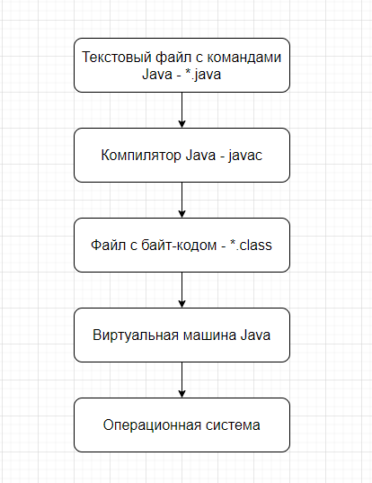

## Core

[1. Что такое виртуальная машина?](#1-Что-такое-виртуальная-машина)

[2. К какому типу языка программирования относится Java? Что такое исходный код? Что такое байт-код?](#2-К-какому-типу-языка-программирования-относится-Java-Что-такое-исходный-код-Что-такое-байт-код)

[3. Из каких компонентов состоит Java (JDK, JRE, JVM)?](#3-Из-каких-компонентов-состоит-Java-JDK-JRE-JVM)

[4. Для чего используется JDK?](#4-Для-чего-используется-JDK)

[5. Для чего используется JRE?](#5-Для-чего-используется-JRE)

[6. Для чего используется VM?](#6-Для-чего-используется-VM)

[7. Что такое переменная?](#7-Что-такое-переменная)

[8. Расскажите про примитивные типы.](#8-Расскажите-про-примитивные-типы)

[9. Опишите шаги для компиляции и запуска приложения в консоли (javac java).](#9-Опишите-шаги-для-компиляции-и-запуска-приложения-в-консоли-javac-java)

[10. Расскажите о конструкциях ветвления (if, else, switch, тернарное выражение)?](#10-Расскажите-о-конструкциях-ветвления-if-else-switch-тернарное-выражение)

[11. Расскажите о таблице истинности?](#11-Расскажите-о-таблице-истинности)

[12. 12. Расскажите про отличия укороченных логических операторов.](#12-Расскажите-про-отличия-укороченных-логических-операторов)

[13. Что такое тернарное условие?](#13-Что-такое-тернарное-условие)

[14. Что такое циклы и для чего они используются?](#14-Что-такое-циклы-и-для-чего-они-используются)

[15. Для чего используется цикл for?](#15-Для-чего-используется-цикл-for)

[16. Для чего используется цикл foreach?](#16-Для-чего-используется-цикл-foreach)

[17. Для чего используется цикл while?](#17-Для-чего-используется-цикл-while)

[18. Для чего используется цикл do while?](#18-Для-чего-используется-цикл-do-while)

[19. Что такое массив?](#19-Что-такое-массив)

[20. Как создать массив?](#20-Как-создать-массив)

[21. Как присвоить значение ячейке массива?](#21-Как-присвоить-значение-ячейке-массива)

[22. Как можно пройти по всем элементам массива?](#22-Как-можно-пройти-по-всем-элементам-массива)

[23. Как можно найти элемент в массиве?](#23-Как-можно-найти-элемент-в-массиве)

[24. Что будет, если записывать элемент по индексу -1?](#24-Что-будет-если-записывать-элемент-по-индексу--1)

[25. Как удалить ячейку в массиве?](#25-Как-удалить-ячейку-в-массиве)

[26. Как отредактировать ячейку в массиве?](#26-Как-отредактировать-ячейку-в-массиве)

[27. Что такое Java code conventions?](#27-Что-такое-Java-code-conventions)

[28. Что такое Unicode?](#28-Что-такое-Unicode)

[29. Округление целочисленного деления при преобразовании в double.](#29-Округление-целочисленного-деления-при-преобразовании-в-double)

# 1. Что такое виртуальная машина?

Виртуальная машина (ВМ) — это программное обеспечение, которое имитирует физическую компьютерную систему, позволяя
запускать операционные системы и приложения так, как если бы они работали на реальном компьютере. Виртуальные машины
позволяют создавать несколько изолированных сред на одном физическом устройстве, что обеспечивает более эффективное
использование ресурсов и гибкость в управлении.

[К оглавлению](#Core)

## 2. К какому типу языка программирования относится Java? Что такое исходный код? Что такое байт-код?

Java, является высокоуровневым языком программирования, использует исходный код,
который компилируется в байт-код для достижения платформенной независимости и эффективного выполнения программ.

Исходный код — это текст программы, написанный программистом на языке программирования высокого уровня, таком как Java.
Исходный код представляет собой человеко-читаемый набор инструкций, которые описывают,
что должна делать программа.

Байт-код — это промежуточный код, который генерируется компилятором Java (javac) после компиляции исходного кода.
Байт-код не зависит от платформы и может быть выполнен на любой системе,
где установлена соответствующая Java Virtual Machine (JVM).
Байт-код не является человеко-читаемым и представляет собой набор инструкций,
которые JVM интерпретирует или компилирует в машинный код в процессе выполнения программы.

[К оглавлению](#Core)

## 3. Из каких компонентов состоит Java (JDK, JRE, JVM)?
JDK - среда для разработки программ на Java, включающая в себя JRE - среду для обеспечения запуска Java
программ, которая в свою очередь содержит JVM - интерпретатор кода Java программ.

[К оглавлению](#Core)

## 4. Для чего используется JDK?

JDK, Java Development Kit (Комплект разработки на Java) - JRE и набор инструментов разработчика приложений на языке
Java, включающий в себя компилятор Java, стандартные библиотеки классов Java, примеры, документацию, различные утилиты.


[К оглавлению](#Core)

## 5. Для чего используется JRE?

JRE, Java Runtime Environment (Среда времени выполнения Java) - минимально-необходимая реализация виртуальной машины для
исполнения Java-приложений. Состоит из JVM и стандартного набора библиотек классов Java.

JRE используется для запуска готовых программ Java.
Если нам нужно собрать и запустить программу из исходных
кодов мы используем JDK.

[К оглавлению](#Core)

## 6. Для чего используется VM?

JVM, Java Virtual Machine (Виртуальная машина Java) — основная часть среды времени исполнения Java (JRE). Виртуальная
машина Java исполняет байт-код Java, предварительно созданный из исходного текста Java-программы компилятором Java. JVM
может также использоваться для выполнения программ, написанных на других языках программирования.

[К оглавлению](#Core)

## 7. Что такое переменная?

Это именованная ячейка памяти, которой может быть присвоено значение в программе.

[К оглавлению](#Core)

## 8. Расскажите про примитивные типы.

Целочисленные:

- byte (1 байт или 8 бит, интервал значений[-128, 127]т.е. 2^7, т.к. отрицательные, ноль и положительные)
- short (2 байта или 16 бит),[-32768, 32767]
- int (4 байта),[-2147483648, 2147483647]
- long (8 байт),[-9223372036854775808, 9223372036854775807]

Числа с плавающей точкой:

- float (4 байта)
- double (8 байт)

Символьный:

- char (символ Unicode, 2 байта, [0, 65536])

Логический:

- boolean (значение истина/ложь)

[К оглавлению](#Core)

## 9. Опишите шаги для компиляции и запуска приложения в консоли (javac java).

+ Чтобы запустить программу на языке Java, нужно текстовый файл с командами преобразовать в инструкции,
понятные компьютеру. Этот процесс выполняет компилятор Java.
+ Получившийся файл называется файлом с байт-кодом. Чтобы компьютер понял этот байт-код,
его нужно запустить через виртуальную машину Java.
+ Виртуальная машина позволяет запустить байт-код на любых операционных системах.
+ Программист не тратит время на адаптацию программы для работы в Windows, Linux или Mac.
Это выполняет виртуальная машина Java (JVM).
Виртуальная машина - это прослойка между вашей программой и операционной системой.



[К оглавлению](#Core)

## 10. Расскажите о конструкциях ветвления (if, else, switch, тернарное выражение)?

**1. If-else:**

+ **if:**  Используется для выполнения блока кода, если условие истинно.
+ **else:**  Используется для выполнения блока кода, если условие ложно.
```java
int age = 25;
if (age >= 18) {
    System.out.println("Вам разрешено голосовать"); 
} else {
    System.out.println("Вам не разрешено голосовать");   
}
```

Можно использовать несколько вложенных блоков if-else.
```java
int grade = 85;
if (grade >= 90) {
    System.out.println("Отлично");
} else if (grade >= 80) {
    System.out.println("Хорошо");
} else if (grade >= 70) {
    System.out.println("Удовлетворительно");
} else {
    System.out.println("Неудовлетворительно");
}
```
**2. Switch:**

+ **switch:**  Используется для проверки значения переменной на соответствие нескольким случаям.
+ **case:**  Определяет конкретный случай, который нужно проверить.
+ **default:**  Используется для выполнения блока кода, если ни один из случаев не соответствует.
```java
int day = 3;

switch (day) {
    case 1:
        System.out.println("Понедельник");
        break;
    case 2:
        System.out.println("Вторник");
        break;
    case 3:
        System.out.println("Среда");
        break;
    default:
        System.out.println("Неизвестный день недели");
}
```

**3. Тернарное выражение**

Это короткий и компактный вариант записи if-else
```java
условие ? выражение1 : выражение2
```

**Как работает:**
+ **Условие:**  Оценивается как `true` или `false`.
+ **Выражение1:** Выполняется и возвращает результат, если условие `true`.
+ **Выражение2:** Выполняется и возвращает результат, если условие `false`.
```java
int age = 25;
String message = (age >= 18) ? "Вам разрешено голосовать" : "Вам не разрешено голосовать";
System.out.println(message); //Вывод: Вам разрешено голосовать
```

[К оглавлению](#Core)

## 11. Расскажите о таблице истинности?

Конъюнкция. Логическое умножение (&) true - если оба операнда true
Дизъюнкция. Логическое сложение (|) false - если оба операнда false

[К оглавлению](#Core)

## 12. Расскажите про отличия укороченных логических операторов.

&& и || называются укороченными логическими операторами, т.к. если результат булевого выражения может быть определён из
левого
операнда, правый операнд не вычисляется.

[К оглавлению](#Core)

## 13. Что такое тернарное условие?

Тернарный оператор использует три операнда. Выражение записывается в следующей форме: (Условие) ? Выражение, если
условие Истина : Выражение, если условие Ложно;

[К оглавлению](#Core)

## 14. Что такое циклы и для чего они используются?

Цикл — это повторяющийся фрагмент программы. Применяются для
многократного повторения какой-либо операции.

[К оглавлению](#Core)

## 15. Для чего используется цикл for?

Цикл используется для многократного повторения чего-либо, если четко известно кол-во требуемых повторений.

[К оглавлению](#Core)

## 16. Для чего используется цикл foreach?

Цикл foreach используется для итерации по элементам коллекции. Его основное преимущество заключается в простоте
использования и читаемости кода.
Предназначен для строго-последовательного выполнения повторяющихся действий над коллекцией объектов.
Foreach используют всегда, если не нужно менять значение итерационной переменной,
тк она доступна только для чтения.

[К оглавлению](#Core)

## 17. Для чего используется цикл while?

Цикл while используется в Java для повторения блока кода до тех пор, пока выполняется некоторое условие. Условие
проверяется до выполнения тела цикла, поэтому код внутри цикла может ни разу не выполниться.

[К оглавлению](#Core)

## 18. Для чего используется цикл do while?

Цикл do-while отличается от цикла while тем, что условие проверяется после выполнения тела цикла, а не до. Это значит,
что блок кода внутри цикла будет выполнен хотя бы один раз.

[К оглавлению](#Core)

## 19. Что такое массив?

Массив в Java - это группа однотипных переменных, для обращения к которым используется
общее имя. В языке Java допускается создание массивов любого типа
и разной размерности. Доступ к конкретному элементу массива осуществляется
по его индексу. Массивы предоставляют удобный способ группирования связанной
вместе информации.

[К оглавлению](#Core)

## 20. Как создать массив?

Создаем переменную ссылочного типа на массив и ссылаем её на созданный объект массива из 10 элементов: int[] array = new
int[10];

Так же можно не указывать кол-в элементов, а сразу их объявить:

int[] array = new int[]{1, 2, 3};

int[] smallPrimes = { 2, 3, 5, 7, 11, 13};

[К оглавлению](#Core)

## 21. Как присвоить значение ячейке массива?

Присвоить значение ячейке массива в Java можно с использованием индекса, который указывает на конкретный элемент
массива. Индексы начинаются с нуля, то есть первый элемент массива имеет индекс 0, второй элемент — 1, и так далее.

[К оглавлению](#Core)

## 22. Как можно пройти по всем элементам массива?

С помощью циклов.

[К оглавлению](#Core)

## 23. Как можно найти элемент в массиве?

Чтобы найти элемент в массиве в Java, существует несколько подходов в зависимости от задачи: линейный поиск, бинарный
поиск (для отсортированных массивов) или использование встроенных методов.

1. Линейный поиск
   Самый простой способ найти элемент в массиве — это пройти по каждому элементу и сравнить его с искомым значением.
   Этот метод работает для неотсортированных массивов и массивов любого типа.

Пример:

```java


int[] numbers = {10, 20, 30, 40, 50};
int target = 30;
boolean found = false;

for(int i = 0;i<numbers.length;i++){
        if(numbers[i]==target){
        System.out.println("Элемент найден на позиции: "+i);
        found = true;
        break; // Прерываем цикл, если элемент найден
        }
}
        if(!found){
        System.out.println("Элемент не найден");
}
```
Линейный поиск имеет сложность O(n), где n — длина массива.

2. Использование Arrays.binarySearch()
   
Если массив отсортирован, можно использовать бинарный поиск, который значительно быстрее линейного. Стандартная
   библиотека Java предоставляет метод Arrays.binarySearch() для поиска элемента.

Пример:

```java


import java.util.Arrays;

int[] sortedNumbers = {10, 20, 30, 40, 50};
int target = 30;
int index = Arrays.binarySearch(sortedNumbers, target);

if(index >=0){
        System.out.println("Элемент найден на позиции: "+index);
}else{
        System.out.println("Элемент не найден");
}
```
Бинарный поиск имеет сложность O(log n), но требует предварительно отсортированного массива.

[К оглавлению](#Core)

## 24. Что будет, если записывать элемент по индексу -1?

Получим ошибку во время исполнения программы ArrayIndexOutOfBoundsException.

[К оглавлению](#Core)

## 25. Как удалить ячейку в массиве?

Чтобы удалить элемент из массива, нужно создать новый массив меньшего размера, скопировать все элементы из старого
массива в новый, кроме удаляемого элемента, и затем использовать новый массив вместо старого.

[К оглавлению](#Core)

## 26. Как отредактировать ячейку в массиве?

Так же как и присвоить ей значение. Обратиться к массиву по индексу и присвоить значение. Индексирование массива
начинается с нуля.

[К оглавлению](#Core)

## 27. Что такое Java code conventions?

Это соглашение, в котором описаны рекомендации к написанию базовых конструкций языка java - формирование отступов,
пробелов, наименование переменных, методов и т.д. Благодаря таким соглашениям унифицируется почерк разработчика. Код
написанный в едином стиле проще читать, акцентируя внимание на деталях, а не на попытках понять, как устроен сам код.

[К оглавлению](#Core)

## 28. Что такое Unicode?

Это стандарт кодировки символов по всему миру представляющий уникальное число для представления каждого символа,
используемого в современных вычислениях, включая технические символы и специальные символы, используемые при публикации.

[К оглавлению](#Core)

## 29. Округление целочисленного деления при преобразовании в double.

```java
что напечатает код?

public static void main(String[] args) {
    process(3);
}

private static void process(int value) {
    double half = value / 2;
    System.out.println(half);
}
```
Причина, по которой код напечатает 1.0, связана с особенностями деления целых чисел в Java.

В строке:
- double half = value / 2;

значение value имеет тип int, а число 2 также является целым числом. В Java, когда два целых числа делятся друг на друга, результатом будет целочисленное деление, то есть дробная часть отбрасывается.

В данном случае, когда value равно 3, операция 3 / 2 выполняется как целочисленное деление, давая результат 1, а не 1.5. После этого результат 1 преобразуется в тип double, поэтому переменной half присваивается значение 1.0.

Если бы одно из чисел в делении было с плавающей точкой, например, value / 2.0, результат был бы 1.5.

[К оглавлению](#Core)