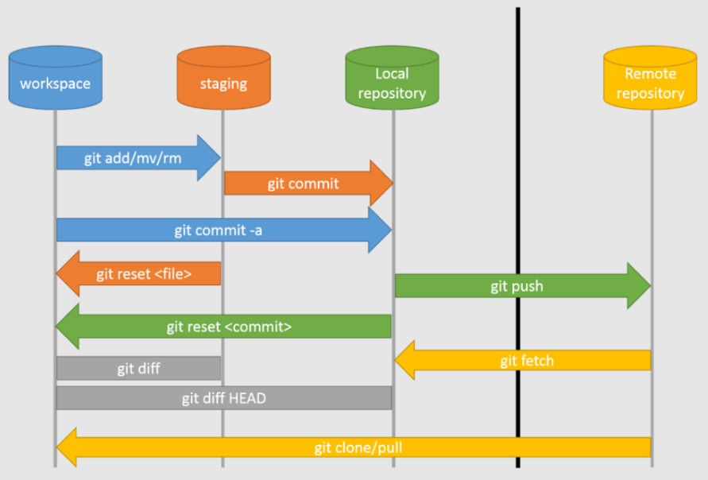

## Git

[1. Что такое индекс?](#1-что-такое-индекс)

[2. Как добавить изменения в индекс? (git add .)](#2-как-добавить-изменения-в-индекс-git-add-)

[3. Как сделать фиксацию изменений? (git commit -m "text")](#3-как-сделать-фиксацию-изменений-git-commit--m-text)

[4. Как сделать синхронизацию изменений с удаленным репозиторием? (git push origin master)](#4-как-сделать-синхронизацию-изменений-с-удаленным-репозиторием-git-push-origin-master)

[5. Как синхронизироваться с удаленным репозиторием? (git pull origin master)](#5-как-синхронизироваться-с-удаленным-репозиторием-git-pull-origin-master)

[6. Как сделать ветку?](#6-как-сделать-ветку)

[7. Как переключиться между ветками?](#7-как-переключиться-между-ветками)

[8. Как отменить локальные изменения?](#8-как-отменить-локальные-изменения)

[9. Расскажи о команде git reset?](#9-расскажи-о-команде-git-reset)

[10. Расскажите о команде git stash](#10-расскажите-о-команде-git-stash)

[11. Расскажите о команде git cherry-pick](#11-расскажите-о-команде-git-cherry-pick)

[12. Расскажите, о команде git rerere. Расскажите, как разрешаются конфликты.](#12-расскажите-о-команде-git-rerere-расскажите-как-разрешаются-конфликты)

Жизненный цикл файлов:



# 1. Что такое индекс?

Индекс в Git — это область подготовки изменений, также известная как staging area. Это промежуточное пространство между
рабочим каталогом (где находятся файлы, которые мы редактируем) и репозиторием (где хранятся зафиксированные коммиты).
Что бы просмотреть индекс, используйте `git status`.

[К оглавлению](#Git)

# 2. Как добавить изменения в индекс? (git add .)

#### Основной синтаксис:

+ `git add <имя_файла>` — добавляет конкретный файл.
+ `git add .` — добавляет все изменения в текущей директории и ее поддиректориях.
+ `git add -A` — добавляет все изменения во всем проекте (аналогично `git add .`, если вы в корне репозитория).
+ `git add <путь>` — добавляет изменения в конкретной папке.

#### Важные моменты:

+ Если вы используете `git add .`, удаленные файлы (те, которые вы удалили вручную) не попадут в индекс. Чтобы учесть
  такие изменения, используйте git add -A.
+ Для работы с конкретными файлами лучше использовать их явные имена (`git add file1.txt`), чтобы избежать случайного
  добавления ненужных изменений.

[К оглавлению](#Git)

# 3. Как сделать фиксацию изменений? (git commit -m "text")

Фиксация изменений в Git выполняется с помощью команды git commit. Она сохраняет изменения, добавленные в индекс, в виде
нового коммита в репозитории.

```java
git commit -m "описание изменений"

-m —позволяет указать сообщение для
коммита прямо в командной строке.
```

#### Важные моменты:

+ Коммит фиксирует только те изменения, которые находятся в индексе. Если вы забыли что-то добавить в индекс, эти
изменения не попадут в коммит.
+ Сообщение коммита должно быть коротким, но информативным. Например:
  + "Добавил метод для расчета налогов"
  + "Оптимизировал запросы к базе данных"
+ Если вы не укажете -m, Git откроет текстовый редактор для ввода сообщения.

[К оглавлению](#Git)

# 4. Как сделать синхронизацию изменений с удаленным репозиторием? (git push origin master)

Синхронизация изменений с удаленным репозиторием в Git выполняется с помощью команды git push. Эта команда отправляет ваши локальные изменения (коммиты) в удаленный репозиторий.
```java
git push <удаленный_репозиторий> <ветка>

<удаленный_репозиторий> — имя удаленного репозитория, 
чаще всего это origin (имя по умолчанию для основного 
репозитория, когда вы его клонируете или связываете).
<ветка> — имя ветки, в которую вы хотите отправить изменения 
(например, master, main или другая ветка).

Пример:

git push origin master
```

#### Важные моменты:

+ Если удаленная ветка не существует, Git предложит создать ее. Вы можете использовать команду:
```java
git push --set-upstream origin master
```
Это создаст ветку master в удаленном репозитории и настроит её отслеживание.

+ В случае конфликта (например, если в удаленном репозитории есть новые изменения), git push выдаст ошибку. Тогда нужно
сначала выполнить git pull, чтобы синхронизировать локальные изменения с удаленными, а затем снова попробовать git push.

[К оглавлению](#Git)

# 5. Как синхронизироваться с удаленным репозиторием? (git pull origin master)

Синхронизация с удалённым репозиторием выполняется с помощью команды git pull. Эта команда объединяет изменения из
удалённого репозитория в вашу локальную ветку.

#### Основной синтаксис:
```java
git pull <удалённый_репозиторий> <ветка>

Пример:

git pull origin master

origin — имя удалённого репозитория (обычно присваивается при клонировании).
master — название ветки, изменения которой вы хотите получить 
(в современных репозиториях часто используется main).
```

#### Как работает git pull:

+ Получение данных:
  + git pull состоит из двух операций:
    + git fetch — скачивает изменения из удалённого репозитория.
    + git merge — сливает эти изменения с вашей локальной веткой.
+ Обновление локальной ветки:
  + Если в удалённой ветке есть новые коммиты, они добавятся в вашу локальную ветку.

#### Важные моменты:

+ Если в вашей локальной ветке есть изменения, которые ещё не были закоммичены, перед выполнением git pull обязательно
сохраните их (коммит или `git stash`), иначе возникнет конфликт.
+ Если слияние вызывает конфликт, Git попросит вас вручную разрешить его. После этого выполните: `git commit`

[К оглавлению](#Git)

# 6. Как сделать ветку?

Создание ветки в Git выполняется с помощью команды `git branch <имя_ветки>`. Ветки позволяют работать над разными задачами
независимо друг от друга, сохраняя основную ветку (например, master или main) в стабильном состоянии.

#### Пример создания ветки:
Допустим, вы хотите создать ветку для разработки новой функции:
```java
git branch feature/new-function

Создаст ветку feature/new-function на основе 
текущей ветки, но не переключит вас на неё.
```
Чтобы переключиться на созданную ветку, используйте:
```java
git checkout feature/new-function

Или, начиная с версии Git 2.23, можно использовать упрощённую команду:
git switch feature/new-function
```
Объединённая команда для создания и переключения на новую ветку:
```java
git checkout -b feature/new-function

Или:

git switch -c feature/new-function
```

#### Важные моменты:

+ Создание ветки — это просто указатель на определённый коммит. Новая ветка будет точно такой же, как текущая ветка в
  момент её создания.
+ Имена веток:
  + Должны быть понятными и отражать суть задачи (например, bugfix/issue-42, feature/user-auth).
  + Нельзя использовать пробелы, лучше заменить их дефисами

[К оглавлению](#Git)

# 7. Как переключиться между ветками?

Переключение между ветками в Git осуществляется с помощью команды git checkout или более новой и удобной команды git
switch.

#### Основной синтаксис:
```java
Старый способ:
git checkout <имя_ветки>

Новый способ (с версии Git 2.23):
git switch <имя_ветки>
```
#### Пример переключения:
Допустим, у вас есть ветка feature/new-function и вы хотите на неё переключиться:
```java
Старый способ:

git checkout feature/new-function
Новый способ:

git switch feature/new-function
```
Если ветка не существует, вы можете создать её и сразу переключиться:
```java
Старый способ:
git checkout -b feature/new-function

Новый способ:
git switch -c feature/new-function
```
#### Важные моменты:
+ Неотслеженные изменения:

  + Если у вас есть несохранённые изменения (не закоммиченные), Git может запретить переключение на другую ветку. Чтобы
    сохранить текущие изменения, используйте:

```java
git stash
```
После переключения на нужную ветку восстановите изменения:
```java
git stash pop
```
+ Просмотр текущей ветки:

  + Вы можете узнать, на какой ветке вы сейчас, с помощью:
```java
git branch 
```
Текущая ветка будет отмечена звёздочкой (*).
+ Автоматическая синхронизация:
  + Если вы переключаетесь на удалённую ветку, которая ещё не была синхронизирована с локальной, используйте:
```java
git switch --track origin/<имя_ветки>
```

[К оглавлению](#Git)

# 8. Как отменить локальные изменения?

1. Изменения не добавлены в индекс (modified):
   Если вы изменили файл, но ещё не добавили его в индекс (с помощью `git add`), можно отменить изменения и вернуть файл к
   состоянию из последнего коммита.
```java
Команда:
git checkout -- <имя_файла>

Вернёт файл к состоянию из последнего коммита.

Пример:

git checkout -- myfile.txt
```
2. Изменения добавлены в индекс (staged):
   Если вы уже добавили изменения в индекс, но ещё не создали коммит, нужно сначала удалить их из индекса, а затем
   отменить изменения.

Команды:
```java
Удалить изменения из индекса:
git reset <имя_файла>

Или для всех файлов:
git reset
        
После этого вернуть файл к состоянию из последнего коммита:
git checkout -- <имя_файла>

Пример:

git reset myfile.txt
git checkout -- myfile.txt
```
3. Удалить все локальные изменения (глобально):
   Если вы хотите отменить все изменения во всех файлах, можно выполнить:

```java
Команда:

git reset --hard
Эта команда возвращает весь рабочий каталог и индекс к состоянию последнего коммита.

Пример:

git reset --hard
```
4. Удалить неотслеженные файлы (untracked files):
   Если вы создали новые файлы, которые не добавлены в индекс, и хотите их удалить:
```java
Команда:

git clean -f
удаляет неотслеженные файлы.
        
Для удаления также неотслеженных директорий:
git clean -fd
```
#### Важные моменты:
+ `git reset --hard` необратим. Будьте внимательны, чтобы случайно не потерять важные изменения.
+ Если вы хотите сохранить изменения перед отменой, используйте `git stash`:
Она сохранит изменения в специальном "хранилище", из которого вы можете их восстановить позже.

[К оглавлению](#Git)

# 9. Расскажи о команде git reset?

Команда `git reset` в Git используется для изменения состояния индекса (staging area) и/или рабочей директории. Она
помогает "откатывать" изменения, отменять добавление файлов в индекс, или перемещать указатель на более ранний коммит.
Это мощный инструмент, который можно использовать как аккуратно, так и радикально.

`git reset [параметры] [коммит/файл]`

#### Основные варианты использования:

1. `git reset --soft`

+ Что делает: Перемещает указатель текущей ветки на указанный коммит, сохраняя изменения в индексе и рабочей директории.
+ Использование: Если вы хотите отменить последний коммит, но оставить изменения для редактирования или повторного
  коммита.
```java
Пример:

git reset --soft HEAD~1
Возвращает ветку на один коммит назад, сохраняя все изменения.
```

2. `git reset --mixed` (по умолчанию):

+ Что делает: Перемещает указатель текущей ветки на указанный коммит и удаляет изменения из индекса. Файлы остаются в
  рабочей директории.
+ Использование: Чтобы убрать файлы из индекса для редактирования или отменить добавление в индекс.
```java
Пример:

git reset --mixed HEAD~1
Отменяет последний коммит и удаляет его изменения из индекса, но оставляет их в файлах.
```
3. `git reset --hard`:
 +  Что делает: Перемещает указатель текущей ветки на указанный коммит, очищает индекс и возвращает файлы в рабочей
   директории к состоянию указанного коммита.
 +  Использование: Для полного отката изменений и удаления незафиксированных данных.
```java
Пример:

git reset --hard HEAD~1
Полностью откатывает последний коммит и удаляет все изменения.
Внимание: Использование --hard необратимо, если изменения не сохранены 
где-то ещё.
```

#### Указатели и коммиты:

+ HEAD — текущий коммит.
+ HEAD~1 — предыдущий коммит.
+ `<commit-hash>` — ссылка на конкретный коммит.

#### Для отдельных файлов:

Если вы хотите сбросить изменения только для конкретного файла: `git reset <имя_файла>` , команда удалит файл из
индекса, но оставит его изменения в рабочей директории.
#### Важные моменты:
+ `--soft` безопасно для текущих изменений.
+ `--mixed` убирает изменения из индекса, но сохраняет файлы.
+ `--hard` полностью стирает локальные изменения.

#### Метафора:

`git reset` — это как кнопка "отмена".

+ С `--soft` вы говорите: "Я передумал, но пусть всё остаётся в черновике".
+ С `--mixed` — "Я уберу это из черновика, но не стираю".
+ С `--hard` — "Сотрём всё и начнём заново, как будто ничего не было".

[К оглавлению](#Git)

# 10. Расскажите о команде git stash

Команда git stash в Git используется для временного сохранения изменений в рабочей директории, которые вы пока не хотите
коммитить, но и не хотите потерять. Это полезно, если нужно переключиться на другую ветку или выполнить какие-то
действия, не мешая текущим незавершённым изменениям.

```java
Основной синтаксис:
git stash [параметры]
```

#### Основные команды:

1. `git stash` (сохранение изменений)

+ Сохраняет текущие незакоммиченные изменения в "хранилище" (stash) и очищает рабочую директорию, возвращая её к
  последнему коммиту.
```java
Пример:

git stash
        
После выполнения команды:
Изменения убираются из рабочей директории.
Файлы остаются в состоянии последнего коммита.
```

2. `git stash list` (просмотр списка сохранённых изменений)
    + Показывает список всех сохранённых "хранилищ".
```java
Пример:

git stash list
Вывод будет выглядеть примерно так:
        
stash@{0}: WIP on main: 123abc Добавление новой функции
stash@{1}: WIP on main: 456def Исправление багов
```

3. git stash apply (восстановление изменений)

+ Восстанавливает изменения из stash, но не удаляет их из хранилища.

```java
Пример:

git stash apply stash@{0}

Если вы не указываете stash@{n}, будет применён последний stash.
```

4. git stash pop (восстановление с удалением из хранилища)

+ Восстанавливает изменения из stash и удаляет их из хранилища.

```java
git stash pop
```  

5. git stash drop (удаление сохранённых изменений)

+ Удаляет конкретный stash из хранилища.
```java
git stash drop stash@{0}
```

6. git stash clear (очистка хранилища)

+ Полностью удаляет все stash.
```java
git stash clear
```

#### Дополнительные параметры:

+ Сохранение с сообщением:
```java
git stash save "Сообщение о сохранении"
Позволяет добавить описание stash.
```

+ Сохранение только отслеживаемых файлов:
```java
git stash --keep-index
Сохраняет изменения только для файлов, которые уже добавлены в индекс.
```
+ Сохранение всех файлов (включая неотслеживаемые и игнорируемые):

```java
git stash -u

Или:

git stash --include-untracked
```

#### Важные моменты:

+ Если вы вызываете git stash, не коммитив изменений, они временно сохраняются в "хранилище", чтобы не мешать работе.
+ `git stash` работает только с изменёнными и отслеживаемыми файлами. Чтобы включить неотслеживаемые файлы, используйте
  -u.
+ Если у вас несколько stash, можно выбрать конкретный, указав stash@{n}.

[К оглавлению](#Git)

# 11. Расскажите о команде git cherry-pick

Команда git cherry-pick в Git используется для выбора одного или нескольких коммитов из другой ветки и добавления их в
текущую ветку. Это полезно, если вы хотите перенести изменения (например, исправления багов или новые функции) без
слияния всей ветки, а только отдельных коммитов.

```java
Основной синтаксис:

git cherry-pick <commit-hash>

<commit-hash> — хеш коммита, который вы хотите перенести.
```

#### Пример использования:

Допустим, вы работаете в ветке feature и хотите перенести коммит из ветки bugfix, не сливая всю ветку bugfix:
```java

git cherry-pick a1b2c3d
        
В этом примере a1b2c3d — это хеш коммита, 
который вы хотите перенести в свою текущую ветку.
```

#### Перенос нескольких коммитов:
+ Вы можете выбрать несколько коммитов подряд, указав их хеши через пробел:

`git cherry-pick <commit-hash1> <commit-hash2> <commit-hash3>`

+ Или использовать диапазон коммитов:

`git cherry-pick <commit-hash1>^..<commit-hash2>` - перенесёт все коммиты, начиная с коммита, сразу перед <commit-hash1>, и до <commit-hash2>.

#### Разрешение конфликтов:
Если во время применения коммитов возникает конфликт (например, те же строки в файле были изменены в обеих ветках), Git
остановится и предложит вам вручную разрешить конфликт.

+ Разрешите конфликт в файле.
+ Добавьте изменения в индекс: `git add <имя_файла>`
+ Завершите процесс слияния: `git cherry-pick --continue`

Если вы хотите прервать процесс cherry-pick (например, если решили, что не хотите переносить коммит), используйте:
`git cherry-pick --abort`

#### Отмена cherry-pick:
Если вы случайно применили коммит и хотите отменить его, можно использовать:
`git reset --hard HEAD~1` - удалит последний коммит, который был добавлен с помощью git cherry-pick.

#### Важные моменты:

+ Не всегда линейная история: Использование cherry-pick может сделать историю коммитов менее линейной, потому что один и
тот же коммит может появиться в нескольких местах.
+ Конфликты: Как и при слиянии веток, может возникнуть конфликт, если изменения из выбранных коммитов не совместимы с
текущей веткой.
+ Переносить только нужные коммиты: Это полезно, когда вы хотите перенести только один или несколько коммитов, не сливая
всю ветку.

[К оглавлению](#Git)

# 12. Расскажите, о команде git rerere. Расскажите, как разрешаются конфликты.

Команда `git rerere` (от англ. reuse recorded resolutions) в Git предназначена для автоматического разрешения конфликтов
слияния, которые были уже решены ранее. Это особенно полезно, если вы несколько раз сталкиваетесь с одинаковыми
конфликтами при слиянии веток. Git будет "помнить" ваши решения и применит их автоматически в будущем.

#### Включение git rerere:
По умолчанию git rerere отключен, но вы можете его включить с помощью команды: `git config --global rerere.enabled true`

После этого Git будет записывать решения конфликтов в специальную папку `.git/rr-cache`. Это позволяет повторно
использовать решения для конфликтов, которые уже были разрешены.

#### Как работает git rerere:

+ Первоначальный конфликт: Когда вы пытаетесь слить две ветки, и возникает конфликт, Git остановится и покажет вам, где
возникли проблемы.
+ Решение конфликта: Вы вручную решаете конфликт, выбирая правильные изменения в файлах.
+ Запоминание решения: Git сохранит ваш выбор в кеше, который находится в .git/rr-cache.
+ Следующий конфликт: Если в будущем возникает аналогичный конфликт в том же месте (например, при повторном слиянии
веток), Git автоматически применяет решение из кеша, экономя ваше время.

#### Пример использования:

+ Включение rerere: Включаем rerere, если вы хотите, чтобы Git запоминал решения конфликтов:
`git config --global rerere.enabled true`
+ Разрешение конфликта: Когда возникает конфликт, Git остановит слияние и покажет вам конфликтующие файлы. Вы разрешаете
их, редактируя файлы, добавляете изменения в индекс и завершаете слияние:

`git add <имя_файла>`

`git merge --continue`

+ Повторное слияние: Если вы снова выполняете слияние, и возникнет тот же конфликт, Git автоматически применит решение
из кеша rerere, и вам не нужно будет вручную решать этот конфликт снова.

#### Команды для работы с rerere:

+ Просмотр состояния: Чтобы увидеть, какие конфликты были разрешены с помощью rerere, используйте команду:
`git rerere status`
+ Очистка кэша rerere: Если вы хотите очистить сохранённые решения конфликтов, используйте:
`git rerere gc`
+ Удаление записей: Если вы хотите удалить сохранённые решения для конкретных конфликтов:
`git rerere forget <commit-hash>`

#### Разрешение конфликтов в Git:

Когда Git обнаруживает конфликт, он не может автоматически объединить изменения из разных веток и оставляет это на ваше
усмотрение. Конфликты обычно происходят, когда два человека одновременно изменяли одну и ту же строку в файле или когда
изменения касаются одной и той же области кода.

#### Этапы разрешения конфликта:

+ Конфликт: Когда возникает конфликт, Git добавляет специальные маркеры в файл, чтобы показать, какие изменения
  произошли
  в разных ветках. Маркеры выглядят так:
```java
<<<<<<< HEAD
Изменения из вашей текущей ветки.
=======
Изменения из ветки, с которой вы сливаете.
> > > > > > > branch_name
```
+ Решение конфликта: Вручную редактируйте файл, чтобы выбрать, какие изменения оставить. Вы можете:
  + Оставить изменения только из одной ветки.
  + Объединить изменения из обеих веток.
  + Удалить строки, которые не нужны.
+ Добавление файлов в индекс: После того как вы разрешите все конфликты, добавьте исправленные файлы в индекс:
`git add <имя_файла>`
+ Завершение слияния: После того как все конфликты будут решены и файлы добавлены в индекс, завершите процесс слияния:
`git merge --continue`
+ Если вы хотите прервать слияние, используйте: `git merge --abort`

[К оглавлению](#Git)