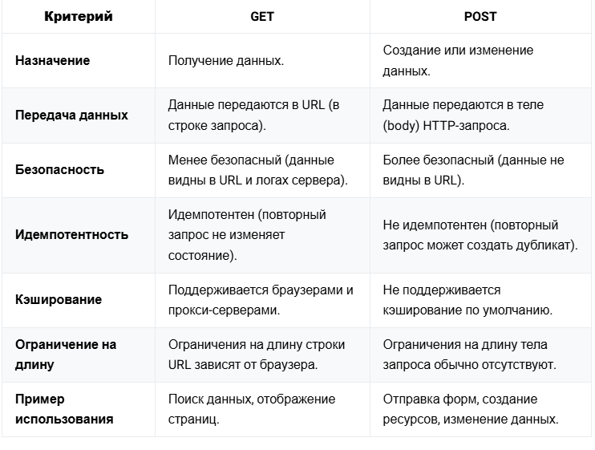

# Webb

[REST](#rest)

[Идемпотентный метод](#идемпотентный-метод)

[Основные HTTP методы](#основные-http-методы)

[GET vs POST](#get-vs-post)

[Что такое HTTP](#что-такое-http)

# REST

REST - это архитектурный стиль взаимодействия клиент-серверного WEB-приложения. Клиент-сервер общаются через протокол
HTTP (HTTPs), а формат данных - JSON (XML).

#### 6 принципов REST API

+ Клиент-серверная архитектура: Клиент и сервер работают независимо друг от друга. Клиент отправляет запросы на сервер,
  сервер их принимает и возвращает ответы. Это позволяет развиваться клиенту и серверу независимо друг от друга
+ Stateless (Отсутствие состояния): Сервер не сохраняет информацию о состоянии клиента между запросами. Информация о
  текущей сессии должна целиком храниться у клиента
+ Кеширование: В REST API сервер может запомнить результаты частых запросов, чтобы быстрее их вернуть и не тратить
  ресурсы на повторные вычисления.
+ Единообразие интерфейса: В API используются стандартные команды (GET, POST, PUT, DELETE), чтобы взаимодействие было
  простым и предсказуемым
+ Многоуровневость системы: Система может быть разделена на несколько слоев, каждый из которых выполняет свою задачу
+ Код по требованию: Иногда сервер может отправлять клиенту код (например, скрипты), который клиент может использовать
  для выполнения задач

[К оглавлению](#Webb)

# Идемпотентный метод

Идемпотентность — это свойство HTTP-запроса, при котором повторный вызов запроса дает тот же результат, что и первый
вызов

[К оглавлению](#Webb)

# Основные HTTP методы

+ GET. Получение ресурса.
+ POST. Создание нового ресурса.
+ PUT. Полное обновление ресурса или создание, если его нет.
+ PATCH. Частичное обновление ресурса.
+ DELETE. Удаление ресурса.
+ HEAD. Получение заголовка ресурса
+ OPTIONS. Узнать доступные методы для ресурса

[К оглавлению](#Webb)

# GET vs POST

#### Почему для конфиденциальных данных рекомендуется использовать POST, а не GET запросы

Безопасность:
+ В GET запросе данные передаются в URL, который может быть виден в истории браузера, логах сервера и прокси. 
+ В POST данные передаются в теле запроса, что снижает риск случайной утечки.

Ограничения длины:
+ Длина URL в GET ограничена браузерами или серверами, поэтому большие объемы данных (например, конфиденциальные формы)
могут не пройти. При использовании метода GET можно использовать не более 2048 символов за вычетом количества символов в
фактическом пути.

Кэширование:
+ GET запросы могут быть кэшированы прокси-серверами или браузерами, что нежелательно для конфиденциальной информации.

#### Можем ли всегда использовать только POST и не работать с GET?

Теоретически — да, но это нарушает принципы REST и архитектуру веб-приложений:
+ GET предназначен для получения данных, POST — для создания. Использование POST для всех операций затрудняет понимание и
поддержку API.
+ GET запросы могут быть кэшированы, что ускоряет работу. POST запросы не кэшируются по умолчанию.
+ GET используется для индексации страниц. Если использовать только POST, страницы не попадут в поисковую выдачу.

[К оглавлению](#Webb)

# Что такое HTTP

HTTP (HyperText Transfer Protocol) – это протокол передачи гипертекста, который используется для взаимодействия браузеров и серверов.

[К оглавлению](#Webb)
