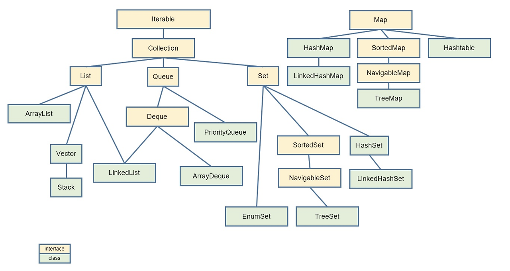
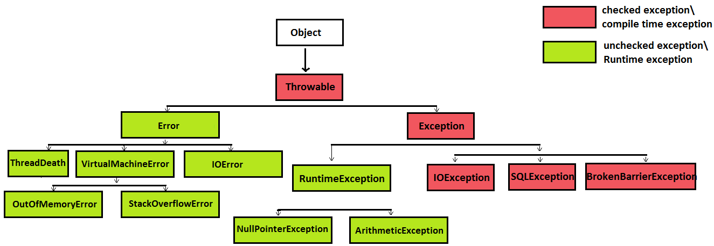

# КорНаизусть

[Иерархия коллекций](#иерархия-коллекций)

[Сравнить ArrayList и LinkedList, области применения, как происходит вставка в середину](#сравнить-arraylist-и-linkedlist-области-применения-как-происходит-вставка-в-середину)

[Что такое Set, его реализации, как внутри работает механизм уникальности элементов](#что-такое-set-его-реализации-как-внутри-работает-механизм-уникальности-элементов)

[Что такое HashMap и её внутренне устройство (как можно подробнее)](#что-такое-hashmap-и-её-внутренне-устройство-как-можно-подробнее)

[Какие критерии должен соблюдать объект чтобы использовать его в качестве ключа в мапе](#какие-критерии-должен-соблюдать-объект-чтобы-использовать-его-в-качестве-ключа-в-мапе)

[Как сделать объект иммутабельным](#как-сделать-объект-иммутабельным)

[Конструктор копирования](#конструктор-копирования)

[Методы из collections](#методы-из-collections)

[Алгоритмы сортировки и их сложность, какая сортировка используется в java](#алгоритмы-сортировки-и-их-сложность-какая-сортировка-используется-в-java)

[Стримы, типы методов в стримах](#стримы-типы-методов-в-стримах)

[Что такое функциональные интерфейсы, примеры функциональных интерфейсов](#что-такое-функциональные-интерфейсы-примеры-функциональных-интерфейсов)

[Какие функциональные интерфейсы используются в стримах](#какие-функциональные-интерфейсы-используются-в-стримах)

[Как работает метод filter() в стримах](#как-работает-метод-filter-в-стримах)

[Что делает метод map() в стримах](#что-делает-метод-map-в-стримах)

[Чем flatMap() отличается от map() в стримах](#чем-flatmap-отличается-от-map-в-стримах)

[Исключения, практический пример обработки исключения](#исключения-практический-пример-обработки-исключения)

[Как создать свое исключение](#как-создать-свое-исключение)

[Зачем разработчики java придумали checked исключения](#зачем-разработчики-java-придумали-checked-исключения)

[Расскажите про методы Object hashCode и equals?](#расскажите-про-методы-object-hashcode-и-equals)

[Принципы ООП (наследование, инкапсуляция, полиморфизм, абстракция)](#принципы-ооп-наследование-инкапсуляция-полиморфизм-абстракция)

[JVM, JRE, JDK, JIT](#jvm-jre-jdk-jit)

[Что такое сборщик мусора (garbage collector)?](#что-такое-сборщик-мусора-garbage-collector)

[Какие типы ссылок существуют в Java](#какие-типы-ссылок-существуют-в-java)

[Области памяти Java](#области-памяти-java)

[Строки/String в Java? Из чего состоит? Нюансы](#строкиstring-в-java-из-чего-состоит-нюансы)

[Что такое пул строк/String pool](#что-такое-пул-строкstring-pool)

[Отличия интерфейса от абстрактных классов](#отличия-интерфейса-от-абстрактных-классов)

[Что такое дженерики? Для чего нужны?](#что-такое-дженерики-для-чего-нужны)

[Что такое лямбда выражение? Чем его можно заменить](#что-такое-лямбда-выражение-чем-его-можно-заменить)

# Иерархия коллекций



Collection<E> — это базовый интерфейс для всех коллекций, за исключением Map. Он включает в себя методы для добавления,
удаления элементов и их проверки.

List<E> — коллекция с упорядоченными элементами, которая допускает дубликаты. Примеры:

+ ArrayList — динамический массив, быстрый доступ по индексу.
+ LinkedList — двусвязный список, эффективен при вставке/удалении в середине.

Set<E> — коллекция, которая не допускает дубликатов. Примеры:

+ HashSet — неупорядоченная коллекция, основанная на хешировании.
+ TreeSet — отсортированное множество, элементы хранятся в порядке возрастания.

Queue<E> — коллекция, представляющая очередь, обычно с операциями добавления в конец и извлечения из начала. Пример:

+ PriorityQueue — очередь с приоритетами.

Map<K, V> — это структура данных для хранения пар "ключ-значение", которая не является наследником Collection, но также
является частью коллекций. Примеры:

+ HashMap — хранит пары ключ-значение, быстрый поиск по ключу.
+ TreeMap — отсортированное по ключам хранилище пар ключ-значение.

В 21 джаве были добавлены три новых интерфейса:

+ `SequencedCollection` - расширяет Collection и добавляет методы для работы с элементами в начале и конце коллекции.
+ `SequencedSet` - специализированный интерфейс для Set, которые сохраняют порядок элементов. Он также предоставляет
  методы для работы с первым и последним элементами
+ `SequencedMap` - интерфейс расширяет Map и добавляет методы для работы с первым и последним элементами в отображении.

[К оглавлению](#КорНаизусть)

# Сравнить ArrayList и LinkedList, области применения, как происходит вставка в середину

— ArrayList реализован внутри в виде обычного массива.
Поэтому при вставке элемента в середину, приходится сначала сдвигать на один все элементы после него, а уже затем в
освободившееся место вставлять новый элемент.
Зато в нем быстро реализованы поиск и изменение элемента – операции get, set, так как в них мы просто обращаемся
к соответствующему элементу массива.

— LinkedList реализован внутри по-другому.
Он реализован в виде двух - связного списка: набора отдельных элементов, каждый из которых хранит ссылку на следующий и
предыдущий элементы. Чтобы вставить элемент в середину такого списка, достаточно поменять ссылки его будущих соседей.
Чтобы получить элемент с номером 200 из 500 элетментов, нужно пройтись последовательно по всем объектам от 0 до 200.
Другими словами операции set и get тут реализованы очень медленно

LinkedList требует больше памяти для хранения такого же количества элементов, потому что кроме
самого элемента хранятся еще указатели на следующий и предыдущий элементы списка, тогда как в ArrayList элементы просто
идут по порядку

Если часто вставляете/удаляете элементы - выбирайте в пользу LinkedList, в противном случае ArrayList

[К оглавлению](#КорНаизусть)

# Что такое Set, его реализации, как внутри работает механизм уникальности элементов

Set — это коллекция, которая хранит уникальные элементы. Она не допускает дубликатов, и порядок элементов не
гарантирован (за исключением некоторых реализаций).

#### Реализации Set:

HashSet

+ HashSet использует HashMap для хранения элементов
+ Быстрый поиск, добавление и удаление элементов (O(1) в среднем).
+ Не гарантирует порядок элементов, так как использует хеш-функцию для хранения.

LinkedHashSet

+ Основан на HashSet, но поддерживает порядок вставки.
+ Хранит элементы в том порядке, в котором они были добавлены.

TreeSet

+ Основан на красно-черном дереве (структура данных).
+ Хранит элементы в отсортированном порядке (по умолчанию по возрастанию, можно задать свой компаратор).
+ Вставка, удаление и поиск занимают O(log n).

#### Как работает механизм уникальности элементов в Set?

HashSet использует HashMap под капотом: объекты являются ключами, а вместо значений используется константа-заглушка. Поэтому алгоритм добавления идентичен HashMap (элемент HashSet == ключ HashMap)

+ Вычисляем хэш-код объекта и бакет, в который будем добавлять объект
+ Если бакет пустой — объект добавляется в бакет, если нет:
  + идем по ключам элементов связного списка (или TreeMap) и сравниваем с добавляемым объектом по хеш-коду и equals()
  + если ключ элемента и объект равны — добавление игнорируется, если нет — переходим к следующему элементу
  + если совпадений не найдено — добавляем объект в конец связного списка (или в TreeMap)

[К оглавлению](#КорНаизусть)

# Что такое HashMap и её внутренне устройство (как можно подробнее)

Ассоциативный массив, хранит пары “ключ-значение”. Ключ-уникальный, значение-может повторяться. Каждая ячейка массива -
бакет(корзина), хранящий в себе односвязный список узлов. Если у односвязного списка node больше 8 элементов (коллизии),
он превращается в красно-чёрное дерево, обратно - если количество элементов в бакете уменьшилось до 6. Может содержать
один ключ null и любое количество значений null. Не отсортирован и не упорядочен. Возможны коллизии - возникают, когда у
разных объектов одинаковые хеш-коды. 

#### сложность операций
+ Добавление (put)	O(1), худшая O(n)
+ Удаление (remove)	O(1), худшая O(n)
+ Поиск (get)	O(1), худшая O(n)
+ Проверка наличия (containsKey / containsValue) O(1) / O(n) , худшая O(n)
+ Итерация по элементам	O(n), худшая O(n)

#### Устройство HashMap

В HashMap бакет — это элемент массива, в котором хранятся записи (ключ-значение). Если у нескольких ключей совпадает
хеш, их записи попадают в один бакет, где организуются в виде связного списка или сбалансированного дерева (в
зависимости от Java версии). Изначально создается 16 бакетов. Если массив бакетов заполнен на 75 процентов - создается х2 от начального размера.

Чтобы определить номер бакета есть формула: `bucketIndex = (hash & (capacity - 1));` Операция побитового & (AND) используется вместо %, так как она быстрее и эффективнее для степеней двойки.
+ hash — хэш-код ключа, который возвращает метод key.hashCode().
+ capacity — текущая ёмкость таблицы (всегда степень двойки, например, 16, 32). 
+ bucketIndex — индекс бакета, в котором будет храниться элемент.

#### Как работает HashMap

1. Добавление элемента (put)

Метод hashCode() ключа вычисляет целочисленный хэш-код.

Если бакет пуст, элемент добавляется напрямую.
Если бакет уже содержит элементы (коллизия), происходит:

+ идем по ключам элементов связного списка (или TreeMap) и сравниваем с ключом добавляемого элемента по хеш-коду и equals()
+ если ключи равны — перезаписываем значение по этому ключу, если нет — переходим к следующему элементу
+ если не нашли ключ добавляемого элемента (равный и по хеш-коду, и по equals()) — добавляем этот элемент в конец связного списка (или в TreeMap)

2. Поиск элемента (get)

Вычисляется хэш-код ключа, который преобразуется в индекс массива.

В указанном бакете ищется ключ, используя метод equals().

+ Если ключ найден, возвращается значение.
+ Если ключ отсутствует, возвращается null.

3. Удаление элемента (remove)

Вычисляется индекс бакета для удаления.

Поиск ключа с помощью метода equals()

Если элемент найден:

+ Удаляется узел.
+ Ссылки обновляются (если использовался связный список).

[К оглавлению](#КорНаизусть)

# Какие критерии должен соблюдать объект чтобы использовать его в качестве ключа в мапе

Для своего класса в качестве ключа нужен hashCode/equals.

Предпочтительно использовать immutable(неизменяемые) - класс, экземпляры которого не могут быть изменены после создания(например String)
Потому что, если изменить объект на котором основан ключ, то у него поменяется хеш-код найти элемент в HashMap-е не получится.

[К оглавлению](#КорНаизусть)

# Как сделать объект иммутабельным

Чтобы создать иммутабельный объект, нужно соблюсти несколько правил:

+ Класс должен быть final, чтобы предотвратить его наследование. Это важно, чтобы не было возможности изменить поведение
  объекта через подклассы.
+ Поля объекта должны быть private final только для чтения. Это гарантирует, что значения этих полей могут быть
  присвоены только один раз — в конструкторе.
+ Поля должны быть инициализированы только через конструктор, и не должно быть сеттеров, которые позволяют изменять их
  после создания объекта.

[К оглавлению](#КорНаизусть)

# Конструктор копирования

Конструктор копирования — это конструктор, который создаёт новый объект на основе существующего, копируя значения его
полей. Это особенно полезно, когда нужно создать новый объект с теми же значениями, но не изменить исходный объект.

[К оглавлению](#КорНаизусть)

# Методы из collections

Главным набором методов, который важен при рассмотрении любой коллекции является набор CRUD-операций (create, read,
update, delete). На уровне Collection не существует способа обновить запись в коллекции

- add(Object o) - добавляет элемент в коллекцию.
- iterator() - возвращает итератор для перебора элементов коллекции.
- remove(Object o) - удаляет элемент из коллекции.
- contains(Object o) - проверяет, есть ли элемент в коллекции.
- size() - возвращает количество элементов в коллекции.
- clear() - очищает коллекцию (удаляет все элементы).
- toArray() - возвращает массив, содержащий все элементы коллекции

Collection — это интерфейс, который определяет базовые операции для работы с коллекциями, такими как List, Set и Queue.
Collections — это утилитный класс, который предоставляет статические методы для работы с коллекциями, например,
сортировку, поиск, синхронизацию.

[К оглавлению](#КорНаизусть)

# Алгоритмы сортировки и их сложность, какая сортировка используется в java

Сортировка пузырьком (Bubble Sort): Простой, но неэффективный метод сортировки. В каждом проходе он сравнивает соседние
элементы и меняет их местами, если они в неправильном порядке. Процесс повторяется, пока все элементы не окажутся в
нужном порядке.

+ В худшем и среднем случае: O(n²)
+ В лучшем случае (если список уже отсортирован): O(n)

Сортировка вставками (Insertion Sort): Проходит по списку, вставляя каждый элемент в правильную позицию в уже
отсортированную часть списка. Эффективен для небольших или почти отсортированных данных.

+ В худшем и среднем случае: O(n²)
+ В лучшем случае (если список уже отсортирован): O(n)

Сортировка выбором (Selection Sort): Находит минимальный (или максимальный) элемент в списке и меняет его местами с
первым элементом. Затем повторяет процесс для оставшейся части списка.

+ В худшем и среднем случае: O(n²)

Сортировка слиянием (Merge Sort): Разделяет массив пополам и рекурсивно сортирует каждую половину, затем соединяет их
обратно в отсортированный массив.

+ В худшем, среднем и лучшем случае: O(n log n)

Быстрая сортировка (Quick Sort): Выбирается опорный элемент, массив разделяется на элементы, меньшие и большие опорного,
затем
процесс рекурсивно повторяется для каждой из частей.

+ В худшем случае: O(n²) (когда выбор опорного элемента неудачный)
+ В среднем случае: O(n log n)

В java для сортировки используется Timsort, для примитивных типов Dual-Pivot Quick Sort.
Dual-Pivot Quick Sort — сортировки, который используется в Java для примитивных
типов. Он быстрее классического Quick Sort благодаря использованию двух опорных элементов и более эффективному
разделению массива.(массив делится на 3 части, а у быстрой сортировки на 2)

Timsort — это гибридный алгоритм сортировки, который сочетает в себе идеи сортировки вставками (Insertion Sort) и
сортировки слиянием (Merge Sort).

+ Использует сортировку вставками для небольших подмассивов (так как она эффективна для малых данных).

+ Использует сортировку слиянием для объединения отсортированных подмассивов (так как она эффективна для больших данных
  и устойчива).

[К оглавлению](#КорНаизусть)

# Стримы, типы методов в стримах

Представляет собой последовательность элементов, над которой можно производить различные операции. Его задача -
упростить работу с наборами данных , в частности, упростить операции фильтрации, сортировки и другие манипуляции данными

Методы стримов делятся на два типа:

+ Промежуточные операции (intermediate operations): Это операции, которые возвращают новый стрим и выполняются "
  лениво" (то есть только когда бужет вызвана терминальная операция). Пример: filter(), map(), distinct(), sorted(),
  flatMap().

+ Конечные операции (terminal operations): Это операции, которые завершает обработку стрима и возвращают результат,
  например, коллекцию или агрегированное значение. Пример: collect(), forEach(), count(), min(), max().

Основные моменты:

+ Стримы не изменяют исходные данные, а возвращают новый результат.
+ Промежуточные операции выполняются только тогда, когда вызывается конечная операция.

### Какие существуют способы создания Stream? 
+ Пустой стрим. Stream.empty()
+ Стрим из List. list.stream()
+ Стрим из Map. map.entrySet().stream()
+ Стрим из массива. Arrays.stream(array)
+ Стрим из указанных элементов. Stream.of(”1”, “2”, “3”)
+ Конкатенацией двух стримов

[К оглавлению](#КорНаизусть)

# Что такое функциональные интерфейсы, примеры функциональных интерфейсов

Функциональный интерфейс – интерфейс с одним абстрактным методом. Помимо одного абстрактного, может содержать любое
количество статических и дефолтных методов.

+ Predicate<T> – принимает объект типа T и проверяет соблюдение некоторого условия и возвращает результат типа Boolean
+ BiPredicate<T, U> - принимает два объекта типов T и U и проверяет соблюдение некоторого условия и возвращает результат
  типа Boolean
+ Consumer<T> - принимает объект, совершает некоторые действия, но при этом ничего не возвращает.
+ BiConsumer<T, U> - принимает два объекта типов T и U, совершает некоторые действия, но при этом ничего не возвращает.
+ Supplier<T> - не принимает никаких аргументов, но возвращает некоторый объект T.
+ Function<T, R> - принимает аргумент T и приводит его к объекту типа R, который и возвращается как результат.
+ BiFunction<T, U, R> - принимает два аргумента типа T и U и приводит их к объекту типа R, который и возвращается как
  результат
+ UnaryOperator<T> - принимает в качестве параметра объект T, выполняет над ним некоторые операции и возвращает
  результат операций в виде объекта того же типа.
+ BinaryOperator<T> – принимает два аргумента типа T и возвращает объект того же типа.

[К оглавлению](#КорНаизусть)

# Какие функциональные интерфейсы используются в стримах

+ Predicate<T> — используется для фильтрации элементов стрима (метод filter()).
+ Function<T, R> — применяется для преобразования элементов стрима (методы map(), flatMap()).
+ Consumer<T> — используется для выполнения действия над элементами (метод forEach()).
+ Supplier<T> — применяется в методах, генерирующих элементы, например, generate().
+ UnaryOperator<T> — используется в map() для выполнения операций над элементами одного типа.
+ BinaryOperator<T> — применяется в методах агрегации, например, reduce().
+ Comparator<T> — используется для сортировки элементов стрима (метод sorted()).

[К оглавлению](#КорНаизусть)

# Как работает метод filter() в стримах

+ Метод filter() работает по принципу ленивых вычислений, то есть элементы фильтруются только при реальном вызове
  терминальных операций, таких как collect(), forEach().
+ filter() не изменяет исходный стрим, а возвращает новый.
+ filter(Predicate<T> predicate) Используется для фильтрации элементов потока по условию 

[К оглавлению](#КорНаизусть)

# Что делает метод map() в стримах

+ map(Function<T, R> mapper) Преобразует каждый элемент потока в другой элемент
+ Этот метод не изменяет исходный стрим, а создаёт новый с преобразованными элементами.
  Он работает лениво, что означает, что элементы преобразуются только при необходимости (например, когда вызывается
  терминальная операция).
+ map() может быть полезен для таких задач, как преобразование типов (например, из строки в число) или изменение
  значений в коллекции.

[К оглавлению](#КорНаизусть)

# Чем flatMap() отличается от map() в стримах

+ map(): каждый элемент преобразуется в один новый элемент.
+ flatMap(Function<T, Stream<R>> mapper) Разворачивает вложенные структуры, объединяя несколько потоков в один
+ flatMap() полезен для работы с вложенными структурами, такими как коллекции внутри коллекций или стримы внутри
  стримов.

[К оглавлению](#КорНаизусть)

# Исключения, практический пример обработки исключения



Исключения — это события, которые возникают во время выполнения программы и нарушают её нормальную работу. Это могут
быть ошибки ввода-вывода, деление на ноль, отсутствие файла и т.д. В Java исключения делятся на два типа:

+ Проверяемые исключения (Checked exceptions) — это исключения, которые компилятор требует обработать. Например,
  IOException, SQLException.
+ Непроверяемые исключения (Unchecked exceptions) — это исключения, которые не требуют обязательной обработки. Это
  ошибки времени выполнения, такие как NullPointerException, ArrayIndexOutOfBoundsException.

+ Обработка исключений помогает сделать программу более надёжной, предотвращая её аварийное завершение.
+ try-catch используется для обработки различных исключений, что позволяет программе продолжать работу в случае ошибок,
  а не завершаться с аварийным завершением.
+ finally гарантирует выполнение кода, связанного с освобождением ресурсов.

```java
import java.io.*;

public class Example {
    public static void main(String[] args) {
        try {
            FileReader reader = new FileReader("file.txt");
            int data = reader.read();
            reader.close();
        } catch (FileNotFoundException e) {
            System.out.println("Файл не найден: " + e.getMessage());
        } catch (IOException e) {
            System.out.println("Ошибка ввода-вывода: " + e.getMessage());
        } finally {
            System.out.println("Блок finally выполнен.");
        }
    }
}

В данном
примере,
если файл
file.txt не
найден,
будет выброшено
исключение FileNotFoundException,
и оно
будет обработано
в соответствующем
блоке catch.
Блок finally
        выполняется всегда, независимо
от того,
было исключение
        или нет, и
его обычно
используют
для освобождения
ресурсов,например,
закрытия файлов
или соединений."
```

[К оглавлению](#КорНаизусть)

# Как создать свое исключение

Чтобы создать собственное исключение в Java, нужно создать класс, который наследует от Exception или RuntimeException.
Если исключение должно быть проверяемым, мы наследуем от Exception, а если оно может быть непроверяемым, то от
RuntimeException.

[К оглавлению](#КорНаизусть)

# Зачем разработчики java придумали checked исключения

Checked исключения были введены в Java, чтобы заставить разработчиков явно обрабатывать ошибки, которые могут возникнуть
в процессе работы программы, например, при работе с внешними ресурсами (файлы, базы данных, сеть). Это помогает улучшить
надежность программы, так как ошибки, которые могут быть предсказуемыми, обязательно будут обработаны, и разработчик не
забудет их учесть.

Основной принцип заключается в том, что, если есть вероятность ошибки в процессе выполнения, например, при работе с
файлом, с сетью или базой данных, то Java требует, чтобы мы явно обработали такие ошибки, чтобы избежать неожиданных
сбоев или аварийного завершения программы. Это повышает предсказуемость и стабильность приложения

[К оглавлению](#КорНаизусть)

# Расскажите про методы Object hashCode и equals?

Методы, необходимые для определения равенства объектов.
Метод `hashCode()` используется для числового представления объекта, метод `equals()` для сравнения двух объектов.
HashCode() и equals() взаимосвязаны, используются для определения равенства между объектами.

Сначала вычисляется hashCode() объектов, тк эта операция быстрее equals(). Если hashCode равны, то начинается проверка
на equals.
Если hashCode не равны, то дальнейшая проверка на равенство не проводится.

#### Контракт equals + hashcode:

+ Если hashCode() двух объектов возвращает разные значения, то они не могут быть равны
+ Если equals() объектов true, то и хеш-коды должны быть равны
+ Переопределив equals(), всегда переопределять hashCode()
+ Если у объектов одинаковый hashCode(), то они не обязательно equals()
+ При каждом вызове hashCode() для одного и того же объекта должен возвращаться один и тот же хеш-код

#### Свойства equals

- Рефлексивность. Объект должен быть равен самому себе (x.equals(x) == true)
- Симметричность. Любые два объекта должны иметь одно и то же мнение относительно своего равенства или неравенства (
  x.equals(y) == true и y.equals(x) == true)
- Транзитивность. Если один объект равен второму, а второй равен третьему, то и первый объект должен быть равен
  третьему (x.equals(y) == true и y.equals(z) == true и x.equals(z) == true)
- Непротиворечивость. Если два объекта равны, они должны быть равны всегда, пока один из них (или оба они) не будет
  изменен
- Для любой ненулевой ссылки на значение х выражение х.equals(null) должно возвращать false

### Свойства hashCode():

+ Согласованность. При каждом вызове hashCode() для одного и того же объекта в рамках одной программы должно
  возвращаться одно и то же значение, если поля объекта, участвующие в расчете хеш-кода, не изменились
+ Равенство и хеш-код. Если два объекта равны по методу equals(), их хеш-коды тоже должны быть равны. Однако обратное не
  обязательно — объекты с одинаковым хеш-кодом могут быть не равны
+ Распределение. Реализация hashCode(), возвращающая разный хеш-код для неравных объектов позволяет увеличить
  эффективность работы с хеш-структурами данных (такими как HashMap или HashSet) за счёт распределения объектов по
  разным корзинам хеш-таблицы

### Что будет, если переопределить equals() не переопределяя hashCode()?

+ Объект, который по equals() равен существующему ключу в HashMap, может не быть найден, если их хеш-коды различаются. Это связано с тем, что HashMap сначала использует hashCode() для поиска корзины, а уже потом сравнивает объекты по equals().
+ При попытке удалить ключ, который равен другому ключу по equals(), но имеет другой hashCode(), удаление может не сработать.

Какова роль equals() и hashCode() в HashMap?
hashCode позволяет определить корзину для поиска элемента, а equals используется для сравнения ключей элементов в списке корзины и искомого ключа.

[К оглавлению](#КорНаизусть)

# Принципы ООП (наследование, инкапсуляция, полиморфизм, абстракция)

Инкапсуляция - объединение данных и методов, работающих с ними в одном классе, а так же сокрытие деталей реализации от
пользователя. Очевидные примеры инкапсуляции - это: модификаторы доступа, getter-ы и setter-ы.

Наследование - возможность порождать один класс от другого(родительского) с сохранением всех его свойств и методов,
добавляя при необходимости новые свойства и методы

Полиморфизм - возможность использовать объекты с одинаковым интерфейсом без информации о типе и внутренней структуре
объекта. Полиморфизм бывает:

+ Динамическим (@Override) Берем метод из родительского класса и пишем свою - специфическую реализацию
+ Статическим (перегрузка) Можно определить внутри одного класса несколько методов с одинаковым названием, но при условии,
что параметры этих методов различны

Абстракция – это способ выделить набор общих характеристик объекта, исключая из рассмотрения частные и незначимые.
Соответственно, абстракция – это набор всех таких характеристик.

[К оглавлению](#КорНаизусть)

# JVM, JRE, JDK, JIT

+ JVM - Виртуальная машина Java, которая исполняет байт-код 
+ JRE - Среда выполнения Java. Включает в себя JVM и стандартные библиотеки классов
  + java.lang - String, System, Object 
  + java.io - InputStream, OutputStream 
  + java.util - коллекции (List, Set, Map)
+ JDK - Набор инструментов для разработки. Включает в себя JRE, компилятор и другие утилиты 
+ JIT - компиляция байт-кода в машинный во время выполнения программы

[К оглавлению](#КорНаизусть)

# Что такое сборщик мусора (garbage collector)?

В Java используется автоматическое управление памятью. Программист выделяет память, а за освобождение отвечает JVM.
Когда программа больше не ссылается на объект (прямые или косвенные ссылки), то объект удаляется, а память
переиспользуется. Сборщик мусора – это демон-поток, который выполняет две задачи:
+ поиск
+ очистка мусора.

### Как работает GC?

1)Поиск недостижимых объектов: Проверяет, есть ли ссылки на объект.

2)Очистка: Если объект недостижим, его память освобождается.

3)Обновление памяти: Освобождённая память становится доступной для новых объектов.

### Основные алгоритмы GC:

+ Mark-and-Sweep: Отмечает используемые объекты и удаляет неиспользуемые. 
+ Generational GC: Разделяет память на молодое, старшее и постоянное поколение для оптимизации работы.

### Какие виды GC знаешь?

+ Serial GC: Подходит для небольших приложений (однопоточный).
+ Parallel GC: Использует несколько потоков, подходящий для многопоточных приложений. 
+ CMS (Concurrent Mark-Sweep): Быстрый сбор мусора, минимизирует паузы. 
+ G1 GC (Garbage First): Балансирует между производительностью и паузами. (по умолчанию)
+ ZGC: Для приложений с низкими паузами, работающими с большим объёмом памяти. 
+ Shenandoah GC: Минимизирует паузы сборщика мусора.

[К оглавлению](#КорНаизусть)

# Какие типы ссылок существуют в Java

+ Сильная ссылка. Обычная ссылка, которая повсеместно используется (Object obj = new Object()). Объект не будет удален сборщиком мусора, пока на него есть хотя бы одна сильная ссылка 
+ Мягкая ссылка. Используются для кеширования. Объект, на который ссылается мягкая ссылка, будет удален сборщиком мусора только при нехватке памяти (SoftReference<MyObject> softRef = new SoftReference<>(new MyObject()))
+ Слабая ссылка. Объект, на который ссылается слабая ссылка, может быть удален сборщиком мусора при следующей проверке, даже если на него есть слабые ссылки (WeakReference<MyObject> weakRef = new WeakReference<>(new MyObject()))
+ Фантомная ссылка. Используется для отслеживания, когда объект был удален из памяти. Фантомная ссылка не позволяет получить доступ к объекту напрямую, она только сигнализирует, что объект скоро будет удален (PhantomReference<MyObject> phantomRef = new PhantomReference<>(new MyObject(), referenceQueue))

[К оглавлению](#КорНаизусть)

# Области памяти Java

`Stack` - это область хранения данных. Всякий раз, когда вызывается метод, в памяти стека создается новый блок, который
содержит примитивы и ссылки на другие объекты в методе. Как только метод заканчивает работу, блок также перестает
использоваться, тем самым предоставляя доступ для следующего метода. Стек в Java работает по схеме LIFO (Последний
зашел - Первый вышел)

`Heap` (куча) используется для выделения памяти под объекты и классы. Создание нового объекта также происходит в куче.
Любой объект, созданный в куче, имеет глобальный доступ и на него могут ссылаться из любой части приложения.

`Method Area` Хранит информацию о классах (имена классов, методы, переменные). Общая для всех потоков.

`PC Register` Хранит адрес текущей инструкции, выполняемой потоком. Каждый поток имеет свой собственный регистр.

`Native Method Stack` Для выполнения нативных методов (написанных на других языках).

`Code Cache` Хранит скомпилированный JIT-код для повышения производительности

`Metaspace` Для хранения метаданных классов. Заменяет Permanent Generation (PermGen).

### В чём разница между Stack и Heap?

+ Куча больше стека 
+ Стек хранит примитивы и ссылки на объекты, а куча хранит все созданные объекты 
+ Память стека существует пока выполняется текущий метод, а куча существует пока работает приложение 
+ Стек быстрее кучи

### В какой области памяти содержатся типы данных?

+ Метаданные классов	В Metaspace
+ Ссылки на объекты	В стеке.
+ Примитивные типы	В стеке (локальные переменные) или куче (поля объекта).
+ Объекты	В куче.

[К оглавлению](#КорНаизусть)

# Строки/String в Java? Из чего состоит? Нюансы

Класс String представляет строковый набор символов.

Класс String - immutable из-за модификатора final и отсутствия сеттера. При редактировании строк будет создаваться новая строка

[К оглавлению](#КорНаизусть)

# Что такое пул строк/String pool

Пул строк — это особая область кучи (heap), где хранятся объекты строк. Служит в первую очередь для оптимизации работы со строковыми литералами. При объявлении литерала (строки в двойных кавычках) в пуле происходит поиск этой строки:

+ Если такой строки в пуле нет ⇒ создается строка, возвращается ссылка 
+ Если есть ⇒ возвращается ссылка найденной строки

Строки, созданные с помощью new String() не помещаются в пул строк и хранятся в куче как остальные объекты.

Что делает метод intern() в классе String?  Помещает строку в пул строк/

[К оглавлению](#КорНаизусть)

# Отличия интерфейса от абстрактных классов

+ Абстрактные классы используются, когда есть отношение ‘is a’, а интерфейс может быть реализован классами, вовсе не связанными друг с другом
+ Унаследовать можно только один класс, а реализовать интерфейсов — сколько угодно

Когда использовать
+ Если есть общая логика, которую наследники могут переопределять - Абстрактный класс
+ Для определения контрактов, которые реализуют классы - Интерфейс

Модификаторы доступа по умолчанию
+ Абстрактный класс - protected, default
+ Интерфейс - public

Наличие конструктора
+ Абстрактный класс - yes
+ Интерфейс - no

Наследование/реализация
Абстрактный класс - Класс может наследовать только один абстрактный класс
+ Интерфейс - Класс может реализовать несколько интерфейсов

Методы с реализацией
Абстрактный класс - Может содержать методы с реализацией
+ Интерфейс - С Java 8: может содержать default методы с реализацией

[К оглавлению](#КорНаизусть)

# Что такое дженерики? Для чего нужны?

Дженерики - параметризованные типы в Java. Позволяют создавать классы, интерфейсы и методы с типами, заданными как
параметры. Позволяют использовать один класс для разных типов данных `(List<String>, List<Integer>)`

Набор рекомендаций от Oracle о том, когда какие обозначения лучше использовать в дженериках:

+ E — element, для элементов параметризованных коллекций; 
+ K — key, для ключей map-структур; 
+ V — value, для значений map-структур; 
+ N — number, для чисел; 
+ T — type, для обозначения типа параметра в произвольных классах; 
+ S, U, V и так далее — применяются, когда в дженерик-классе несколько параметров.


[К оглавлению](#КорНаизусть)

# Что такое лямбда выражение? Чем его можно заменить

Лямбда – набор инструкций, которые можно выделить в отдельную переменную и затем многократно использовать. Являются сокращённой формой внутренних анонимных классов.

Чем его можно заменить?
+ Анонимным классом 
+ Обычным классом, реализующим интерфейс 
+ Ссылкой на метод (method reference)

#### Анонимный класс vs лямбда

Это два способа реализации интерфейсов или создания компактного кода в Java. Они имеют сходства, но различаются по
способу использования, синтаксису и некоторым ограничениям.

+ Анонимный класс — это локальный класс без имени, который объявляется и создаётся одновременно. 
+ Лямбда — это краткий способ объявления реализации функционального интерфейса (интерфейса с одним методом).

[К оглавлению](#КорНаизусть)
